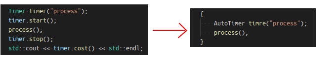
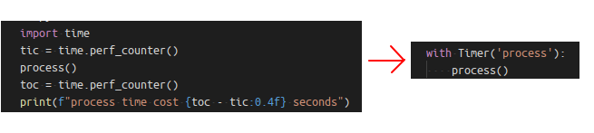

# AutoTimer的C++和Python实现

## 0x1 目的
使用一句代码调用， 替代繁杂的多行代码， 包裹住需要被测量耗时的代码区块， 自动开启计时器、输出耗时。

对于 C++ 代码， 原来的测量耗时代码：
```c++
Timer timer("process");
timer.start();
process();
timer.stop();
std::cout << timer.cost() << std::endl;
```
将被简化为如下写法， 并保持同样的输出：
```c++
{
    AutoTimer timre("process");
    process();
}
```



对于 Python, 原来的测量耗时代码：
```python
import time
tic = time.perf_counter()
process()
toc = time.perf_counter()
print(f"process time cost {toc - tic:0.4f} seconds")
```
将被简化为如下写法， 并保持同样的输出：
```python
with Timer('process'):
    process()
```




## 0x2 C++ 实现 Autotimer

### 想法
在 C++ 中是通过在 Timer 类的构造函数中开启计时、 在析构函数中停止计时来实现的。

大花括号提供了变量作用域的起始和结束， 通常是 Timer 配合大括号（或整个函数）来完成耗时的自动测量。

具体实现时有多种选择：
- C++ 标准用 C++03 还是 11， 或更高版本？ 我的选择是 C++03
- 是否支持 windows 和 linux 以及 android？ 我的选择是用宏控制， 分别实现
- 使用的耗时测量函数是哪个？

### 实现
`AutoTimer.hpp` 代码如下：
```c++
#pragma once

#if _WIN32
#ifndef NOMINMAX
#define NOMINMAX
#endif // NOMINMAX
#ifndef WIN32_LEAN_AND_MEAN
#define WIN32_LEAN_AND_MEAN
#endif // WIN32_LEAN_AND_MEAN
#include <windows.h>
#else
#include <sys/time.h>
#endif

#include <string>

#define AUTOTIMER_STDIO 1

#if AUTOTIMER_STDIO
#if __ANDROID_API__ >= 8
#include <android/log.h>
#define AUTOTIMER_LOGE(...)                                            \
    do {                                                               \
        fprintf(stderr, ##__VA_ARGS__);                                \
        __android_log_print(ANDROID_LOG_WARN, "plain", ##__VA_ARGS__); \
    } while (0)
#else
#include <stdio.h>
#define AUTOTIMER_LOGE(...)             \
    do {                                \
        fprintf(stderr, ##__VA_ARGS__); \
    } while (0)
#endif
#else
#define AUTOTIMER_LOGE(...)
#endif

/// Return time in milliseconds (10^(-3) seconds)
static inline double getCurrentTime()
{
#ifdef _WIN32
    LARGE_INTEGER freq;
    LARGE_INTEGER pc;
    QueryPerformanceFrequency(&freq);
    QueryPerformanceCounter(&pc);
    return pc.QuadPart * 1000.0 / freq.QuadPart;
#else
    struct timespec ts;
    clock_gettime(CLOCK_MONOTONIC, &ts);
    return ts.tv_sec * 1000.0 + ts.tv_nsec / 1000000.0;
#endif // _WIN32
}

static inline double getElapsedTime(const double startTime)
{
    return getCurrentTime() - startTime;
}

class AutoTimer
{
public:
    explicit AutoTimer(const std::string& name, int loopCount = 1, bool autoReport = true, bool onlyAverage = false)
        : mName(name), mLoopCount(loopCount), mStartTime(getCurrentTime()), mAutoReport(autoReport), mOnlyAverage(onlyAverage), mCurrentStartTime(getCurrentTime()), mPunchCount(0)
    {
    }
    ~AutoTimer()
    {
        if (mAutoReport)
            this->report();
    }

    void report() const
    {
        //std::cout << mName << ": took " << GetElapsed() << " ms" << std::endl;
        if (mOnlyAverage)
        {
            double averageCost = getElapsedTime(mStartTime) / mLoopCount;
            AUTOTIMER_LOGE("%8s: took %7.3lf ms (on average)", mName.c_str(), averageCost);
        }
        else
        {
            double totalCost = getElapsedTime(mStartTime);
            AUTOTIMER_LOGE("%8s: took %7.3lf ms", mName.c_str(), totalCost);
            if (mLoopCount > 1)
            {
                AUTOTIMER_LOGE(", loop=%d, avg = %6.3lf ms", mLoopCount, totalCost / mLoopCount);
            }
        }
        AUTOTIMER_LOGE("\n");
    }

    /// Return time in milliseconds
    double getElapsed() const
    {
        return getElapsedTime(mStartTime);
    }

    double getElapsedAverage() const
    {
        return getElapsedTime(mStartTime) / mLoopCount;
    }

    void reset(int loopCount = 1)
    {
        mStartTime = getCurrentTime();
        mLoopCount = loopCount;
    }

    // record current loops time cost
    void punch()
    {
        if (mPunchCount < maxPunchCount)
        {
            double now = getCurrentTime();
            data[mPunchCount] = now - mCurrentStartTime;
            mCurrentStartTime = now;
            mPunchCount++;
        }
    }

    // print each loop's time cost
    void reportPunches()
    {
        AUTOTIMER_LOGE("    time cost of each:");
        for (int i = 0; i < mPunchCount; i++)
        {
            AUTOTIMER_LOGE(" %5.2lf ms,", data[i]);
        }
        AUTOTIMER_LOGE("\n");
    }

public:
    const static int maxPunchCount = 100;
    double data[maxPunchCount]; // punch data for each loop.

private:
    AutoTimer(const AutoTimer&);
    AutoTimer& operator=(const AutoTimer&);

private:
    std::string mName;
    int mLoopCount;
    double mStartTime;
    bool mAutoReport;
    bool mOnlyAverage;

    double mCurrentStartTime;
    int mPunchCount;
};
```

## 0x3 Python 实现 Autotimer

### 上下文管理器
Python 中的 `with` 提供了和 C++ 中的大花括号 `{}` 表达的作用域范围类似的效果。当 `with` 语句开始运行时， 会在上下文管理器对象上调用 `__enter__()` 方法； 在 `with` 语句运行结束后， 会在上下文管理器对象上调用 `__exit__()` 方法。

上下文管理器对象， 指的是支持上下文管理器协议的类的对象。

来复习一下 `with` 的语法：
```python
with context_expression [as target(s)]:
    with-body
```

`with` 语法看起来非常简单， 但对 `with` 后面的 `context_expression` 上下文表达式有要求， 它不能是任意的表达式， 而是应当实现上下文管理器协议, 也就是实现 `__enter__()` 和 `__exit__()` 方法。

换言之， 上下文管理器对象 x 的生命周期中， 按先后顺序调用这几个函数： 
- `x.__init__(self)`
- `x.__enter__(self)`
- `x.__exit__(self)`


### 代码实现
Python 实现的 AutoTimer 代码如下：
```python
# coding: utf-8

from dataclasses import dataclass

@dataclass
class Timer:
    def __init__(self, name):
        self._start_time = None
        self._name = name

    def start(self):
        """Start a new timer"""
        if self._start_time is not None:
            raise TimerError(f"Timer is running. Use .stop() to stop it")
        self._start_time = time.perf_counter()

    def stop(self):
        """Stop the timer, and report the elapsed time"""
        if self._start_time is None:
            raise TimerError(f"Timer is not running. Use .start() to start it")

        elapsed_time = time.perf_counter() - self._start_time
        self._start_time = None
        print(f"{self._name:s} took time: {elapsed_time:0.4f} seconds")

    def __enter__(self):
        """Start a new timer as a context manager"""
        self.start()
        return self

    def __exit__(self, *exc_info):
        """Stop the context manager timer"""
        self.stop()


def test():
    """
    download and print the latest tutorial from Real Python
    """

    from reader import feed

    # tic = time.perf_counter()
    # tutorial = feed.get_article(0)
    # toc = time.perf_counter()
    # print(f"!!!Downloaded the tutorial in {toc - tic:0.4f} seconds")

    with Timer('download'):
        tutorial = feed.get_article(0)

    #print(tutorial)

if __name__ == '__main__':
    test()
```

## 0x4 References
- [8.3 让对象支持上下文管理协议](https://python3-cookbook.readthedocs.io/zh_CN/latest/c08/p03_make_objects_support_context_management_protocol.html)
- [Python Timer Functions: Three Ways to Monitor Your Code](https://realpython.com/python-timer/#python-timers)