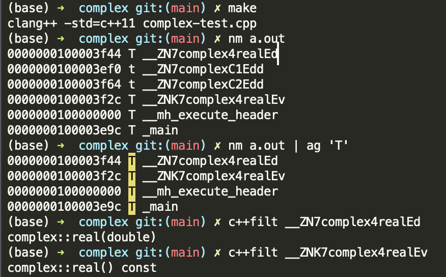
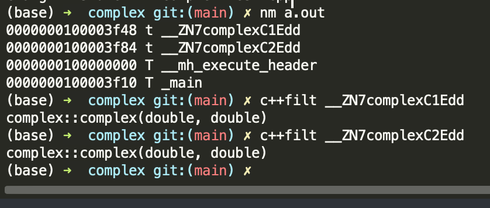
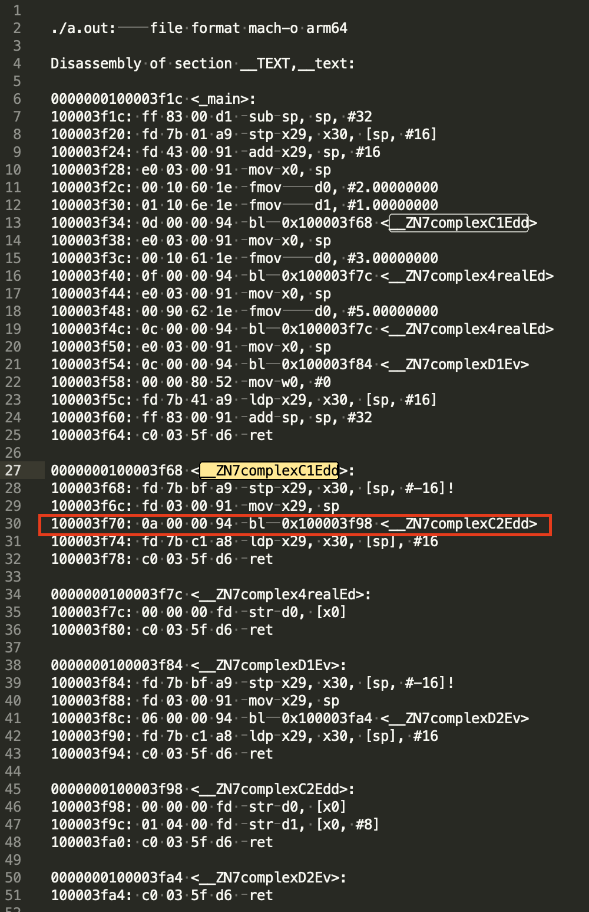

# 查看C++构造函数和成员函数的符号

函数重载是发生在 c++ 语言层面的一件事情。
对应到 elf 二进制文件中， 每个函数对应一个 symbol， 互为重载的函数的 symbol 并不相同。
特别地， 构造函数、 析构函数等特殊函数， 由于 c++ 多态机制的实现需要， 每个特殊函数对应两个符号（至少在 linux 和 macOS 下是这样的）。

## 0x1 目的
复习 C++, 在看候捷老师的 《C++ 面向对象高级开发》的 "3.构造函数.mp4" 时， 想用 nm 命令验证下视频中提到 complex 类的重载后有多个符号（不涉及继承，也不涉及指针类型的成员， 是最简单的类类型）， 同时意外发现单个构造函数、析构函数都会有两个符号。

简要记录如下。

## 0x2 成员函数的重载
```c++
double real() const { return re; } // work as getter
void real(double r) { re = r; }  // work as setter
```

### 完整代码
```c++
#include <iostream>

using std::cout;
using std::endl;

class complex
{
public:
    complex (double r = 0, double i = 0)
        : re(r), im(i)
    {
    }

    complex& operator += (const complex& r);
    double real() const { return re; } // 第一个版本， 获取 re
    double imag() const { return im; }
    void real(double r) { re = r; }    // 第二个版本， 设置 re
private:
    double re, im;
};

int main()
{
    complex c1(2, 1);

    double r = c1.real();
    c1.real(3);

    return 0;
}
```

### 查看二进制符号
在 macOSX 下编译后查看可执行文件中的符号:
```
(base) ➜  complex git:(main) ✗ nm a.out | ag 'T'
0000000100003f44 T __ZN7complex4realEd
0000000100003f2c T __ZNK7complex4realEv
0000000100000000 T __mh_execute_header
0000000100003e9c T _main
```

```
(base) ➜  complex git:(main) ✗ c++filt __ZN7complex4realEd
complex::real(double)
(base) ➜  complex git:(main) ✗ c++filt __ZNK7complex4realEv
complex::real() const
```



可以看到这两个互为重载的 `real()` 函数， 对应的符号名字并不相同。

## 0x3 单个构造函数：有两个符号
仍然是上面的 `complex` 类的定义。
```bash
nm a.out # 这次不用过滤只显示 T 了。 可以看到带 t 的两个符号
```

```
0000000100003f48 t __ZN7complexC1Edd
0000000100003f84 t __ZN7complexC2Edd
0000000100000000 T __mh_execute_header
0000000100003f10 T _main
```



实际上对于析构函数也有同样的情况， 也是对应有两个符号。 这其实**是用来实现多态(polymorphism)的副产物**。根据 [GCC Itanium C++ ABI](https://web.archive.org/web/20100315072857/http://www.codesourcery.com/public/cxx-abi/abi.html) 的文档, 查到了 symbol 命令的一些说明：
```
_Z     | N      | 5Thing  | 3foo | E          | v
prefix | nested | `Thing` | `foo`| end nested | parameters: `void`
```

```
  <ctor-dtor-name> ::= C1   # complete object constructor
                   ::= C2   # base object constructor
                   ::= C3   # complete object allocating constructor
                   ::= D0   # deleting destructor
                   ::= D1   # complete object destructor
                   ::= D2   # base object destructor
```

其中：
- `C1` 表示 "complete object constructor", 会额外构造虚基类(It additionally constructs virtual base classes)
- `C2` 表示 "base object constructor", 创建 object 自身、数据成员以及非虚拟类(creates the object itself, as well as data members and non-virtual base classes)
- `C3` 表示 "allocating object constructor", 它会执行 C1 做的所有事情， 然后同时会调用 operator new 来实际分配内存

如果没有虚基类， 那么 `C1` 和 `C2` 是等效的, GCC 在足够的优化等级下会生成同样的代码：
```
If you have no virtual base classes, [the first two] are are identical; GCC will, on sufficient optimization levels, actually alias the symbols to the same code for both.
```

本地尝试了下， 在开启 O1 优化时， 生成的汇编中表明， C1 会调用 C2:
```bash
clang++ -std=c++11 -O1 complex-test.cpp
objdump --disassemble ./a.out > complex.s  
```



## 0x4 References
- https://stackoverflow.com/questions/6921295/dual-emission-of-constructor-symbols
- https://stackoverflow.com/questions/6355438/overloading-operator-delete-in-a-base-class