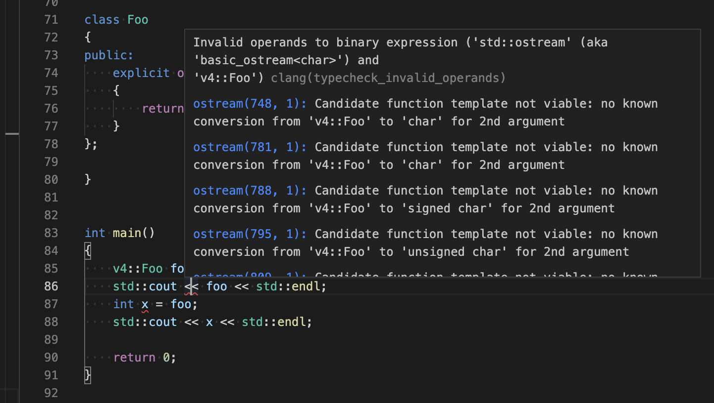

# conversion operator

## 1. 是什么
[conversion operator](https://en.cppreference.com/w/cpp/language/cast_operator) 也叫 cast operator, 是说在一个 class 中实现的一个成员函数， 返回值是另一个类型. 最简单例子如下：

```c++
class Foo
{
public:
    operator int() const
    {
        return 233
    }
};

Foo f;
int a = f; // call the conversion operator function
```
可以发现， conversion operator 的返回值是写在后面的， 而不是像常规的函数那样写在函数最前头。


## 2. 适合做什么
**可以用来转换为一个等价的类型的表示**

例如分数类 `Fraction` 可以转为 double 类型的小数：
```c++
class Fraction
{
public:
    int m_numerator;
    int m_denominator;

public:
    Fraction(int numerator, int denominator)
        : m_numerator(numerator), m_denominator(demoninator)
    {}

    operator double() const
    {
        return numerator * 1.0 / denominator;
    }
}
```

再比如 [ncnn](https://github.com/tencent/ncnn) 的 `ncnn::Mat` 类中， 提供了转为 `float*` 类型的转换， 这也挺方便的。

## 3. 不适合做什么
**不适合转为 std::string 后传给 std::cout 打印**

种种尝试后， 我发现 conversion operator 还是不能像重载全局的 `ostream& operator<<(ostream& os, const Foo& foo)` 后那样直接用于 std::cout 的打印。 会存在多种坑， 例如无限递归导致 segfault， 或者调用不够优雅需要套一层 std::string().

具体看如下代码.

### v1
将 `Foo` 类的对象转为 int 类型， 然后直接打印：
```c++
namespace v1 {
class Foo
{
public:
    operator int()
    {
        return 233;
    }
};
}

int main()
{
    v1::Foo foo;
    std::cout << foo << std::endl;
}
```

打印输出了 `233`，看起来挺好用。那么如果 conversion 的目标类型是 double 呢？

### v2
```c++
namespace v2 {
class Foo
{
public:
    operator double()
    {
        return 233.456;
    }
};
}

int main()
{
    v2::Foo foo;
    std::cout << foo << std::endl;
}
```
打印输出了 `233.456`, 看起来也不错。但如果接收端的变量类型不是 double， 而是 int 呢？

```c++
int main()
{
    v2::Foo foo;
    std::cout << foo << std::endl;
    int x = foo;
    std::cout << x << std::endl;
}
```
可以知道输出了
```
233.456
233
```
这里从 double 转为 int 发生了隐式类型转换， 有时候这不是想要的，甚至可能有点危险。 C++11 提供的 `explicit` 关键字， 除了在构造函数中可以使用， 也可以在 conversion function 中使用 ([cppreference - explicit](https://en.cppreference.com/w/cpp/language/explicit)) . 于是写出第三个版本, 最基本的版本暂告一个段落：

### v3
```c++
namespace v3 {
class Foo
{
public:
    explicit operator double()
    {
        return 233.456;
    }
};
}
```

那么， conversion operator 怎样转到 std::string()， 并且能正常运行？

### v4 
很容易无脑写出如下版本：
```c++
namespace v4 {
class Foo
{
public:
    explicit operator std::string()
    {
        return "I am a foo!";
    }
};
}

int main()
{
    v4::Foo foo;
    std::cout << foo << std::endl;
}
```
然后被 clang 无情的提示说连编译都过不去：


在 [stackoverflow](https://stackoverflow.com/questions/3044690/operator-stdstring-const) 上早有人问过这个问题， 解释说因为匹配到了模板版本的 `operator<<(ostream& os, std::base_string<blablabla>)`, 而模板版函数不会做类型转换。于是仍然无脑写出了如下版本：

### v5
```c++
namespace v5 {

class Foo
{
public:
    operator std::string() const&  // 去掉了 explicit 不然编不过
    {
        return "I am a foo!";
    }
};

// 加了一个 non-template 版本的 std::string 的打印...
std::ostream& operator<<(std::ostream& os, const std::string& s)
{
    return os << s;
}

}

int main()
{
    v5::Foo foo;
    std::cout << foo << std::endl;
}
```
这次可以编译通过了， 然而运行的时候挂了：
```
(base) ➜  complex git:(main) ✗ ./a.out 
[1]    19848 segmentation fault  ./a.out
```
原因是增加的非递归版本的 std::string 的打印函数发生了递归。一开始还很好奇， 连上 lldb 后看对应的代码行感觉看不出问题， 然而 `bt` 命令直接把 lldb 搞挂了就大概知道了， 递归层数太多了。 也可以增加暴力打印来验证：
```c++
std::ostream& operator<<(std::ostream& os, const std::string& s)
{
    static int count = 0;
    count++;
    std::cout << "operator<<(os, string&) " << count << std::endl;
    return os << s;
}
```

嗯， 如果项目时间紧， 又不想扔掉写了一半的 conversion operator 代码， 那就手动把 conversion operator 返回的对象外面套一层 `std::string()` 来创建一个（新的） string 对象吧（摊手, 反正人和代码有一个能跑就行）：

### v6
```c++
namespace v6 {
class Foo
{
public:
    explicit operator std::string() const&
    {
        return "I am a foo!";
    }
};
};

int main()
{
    v6::Foo foo;
    std::cout << std::string(foo) << std::endl;
    return 0;
}
```

### 更多例子
原本目的是实现多种用于 `std::cout << obj` 的方式。

没想到 conversion operator 有点坑：
- 碰到模板函数，模板实参推导不支持隐式类型转换
- 多个 conversion operator 的优先级（rank）
- conversion operator 的优先级，在碰到 template function 的时候又是怎样？
- conversion operator 前面用 explicit 修饰，结果又是怎样？

坑有点深，简单说就是老老实实定义一个专门用来打印的 `operator <<`

具体见如下文件：
- Box.cpp
- entity.cpp
- fraction_v1.cpp
- fraction_v2.cpp
- fraction_v3.cpp
- fraction_v4.cpp

## 5. 参考
- https://en.cppreference.com/w/cpp/language/cast_operator
- https://stackoverflow.com/questions/7455926/segmentation-fault-while-stdstring-assignment
- https://stackoverflow.com/questions/3044690/operator-stdstring-const