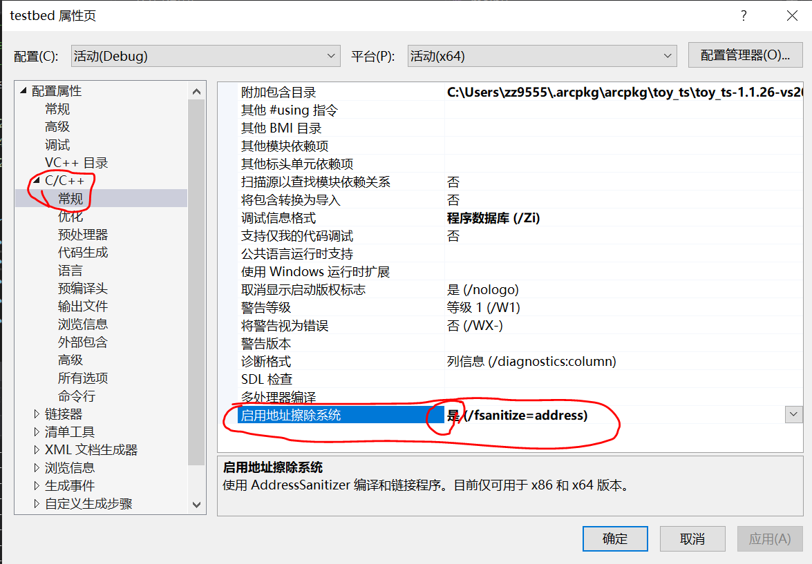

# Sanitizer

## 概要
Address Sanitizer 简称 Asan, 是 GCC/Clang/NDK 等常见编译器内置提供。 用来解决内存泄漏（非VS平台）、内存越界（VS和其他平台）

- LLVM 官方说明： https://clang.llvm.org/docs/AddressSanitizer.html

Linux/Android: 能检查到内存泄漏、内存越界
Windows ( >= vs2019): 能检查到内存越界； 但不能检查泄漏

开启 asan 后， 能够显示内存泄漏或越界对应的**文件名字**、**代码行号**， 帮助快速定位内存问题。

### 平台支持
| 平台                  | 可检测泄漏？ | 可检测越界？ |
| --------------------- | -----------  | ------------ |
| VS(x86/x64)           | ❌          | ✔️          |
| Android(arm32/arm64)  | ❌          | ✔️          |
| Linux(GCC/Clang, x64) | ✔️          | ✔️          |
| AppleClang(x64)       | ✔️          | ✔️          |
| AppleClang(M1, arm64) | ❌          | ✔️          |

### 环境变量
个人常用环境变量如下:
```bash
# 关闭颜色
export ASAN_OPTIONS=color=never

# 开启lsan，检查泄漏
export ASAN_OPTIONS=detect_leaks=1

# 关闭lsan，检查泄漏
export ASAN_OPTIONS=detect_leaks=0

# 检查线程泄漏（tsan）
export TSAN_OPTIONS=report_thread_leaks=1

# 检查泄漏
export LSAN_OPTIONS=verbosity=1:log_threads=1

# 关闭如 std::vector 的超过 size 但小于 capacity 的内存访问的检查
export ASAN_OPTIONS=detect_container_overflow=0
```

官方详细的环境变量默认值：
- https://github.com/google/sanitizers/wiki/SanitizerCommonFlags
- https://github.com/google/sanitizers/wiki/AddressSanitizerFlags
- https://github.com/google/sanitizers/wiki/ThreadSanitizerFlags

## 快速使用: 编译链接阶段

确保被检查的代码对应的库目标、可执行目标都开启了 asan， 并且尽可能是 debug 模式编译来避免编译优化导致的一些定位不准确问题。

**基于 CMake**

下载 [asan.cmake](https://github.com/zchrissirhcz/cmake_examples/blob/master/tools/asan.cmake) 到工程根目录，并在 CMakeLists.txt 里添加：
```cmake
...
project(xxx)
include(asan.cmake) # 加在 project() 之后的第一行
...
```

**Visual Studio**

Visual Studio 官方说明：https://docs.microsoft.com/en-us/cpp/sanitizers/asan?view=msvc-170

(注： 需要 VS2019 或更高版本)
(注：截止 2022-08-12， Visual Studio 里的 ASan 仍不能检测内存泄漏， 只能检查越界等非法访问).



**基于 Android MK**

NDK官方说明：https://developer.android.com/ndk/guides/asan

**基于makefile**

在 FLAGS 中指定 `-fno-omit-frame-pointer -fsanitize=address`

## 快速使用： 运行阶段
**内存越界的检测**
直接运行可执行文件， 运行结束时 ASan 会报告检测出的内存越界问题：
```bash
./testbed
```

**内存泄漏的检测**
对于内存泄漏：Address Sanitizer 在 Linux / Android 下， 默认会检查内存泄漏， 也就是把 LeakSanitizer 顺带开启了， 但是运行阶段可通过环境变量控制是否报告内存泄漏:
```bash
# 设置 ASan 显示内存泄漏检测结果
export ASAN_OPTIONS=detect_leaks=1
./testbed
```

得到输出类似如下：
```
=================================================================
==164520==ERROR: LeakSanitizer: detected memory leaks

Direct leak of 55 byte(s) in 1 object(s) allocated from:
    #0 0x564184a84e7e in malloc (/home/zz/work/dbg/memleak/build/linux-x64/testbed+0xa2e7e) (BuildId: a3e89f9459dec0516a5d1cf020059269ef1a4e6d)
    #1 0x564184ad8667 in tv::fastMalloc(unsigned long) (/home/zz/work/dbg/memleak/build/linux-x64/testbed+0xf6667) (BuildId: a3e89f9459dec0516a5d1cf020059269ef1a4e6d)

SUMMARY: AddressSanitizer: 55 byte(s) leaked in 1 allocation(s).
```

```bash
# 设置 ASan 关闭内存泄漏检测结果
export ASAN_OPTIONS=detect_leaks=0
./testbed
```
则运行后，不显示内存泄漏的报告。

注：库目标不必使用 ASan 编译， 只在 testbed 中开启 ASan 即可检测到泄漏。

## 坑1： stl 容器的误报
https://github.com/google/sanitizers/wiki/AddressSanitizerContainerOverflow

例如 ToyVision 发布版本前在 android 上的单元测试中， 开启了 ASan 后测试报告了 “heap-use-after-free”, 但实际上并没有真的越界。

解决方法1：
```bash
ASAN_OPTIONS=detect_container_overflow=0 ./testbed
```

解决方法2：
开启 ASAN 编译 gtest, 然后在开启 ASAN 编译的工程代码里， 链接这个新的 gtest 库。