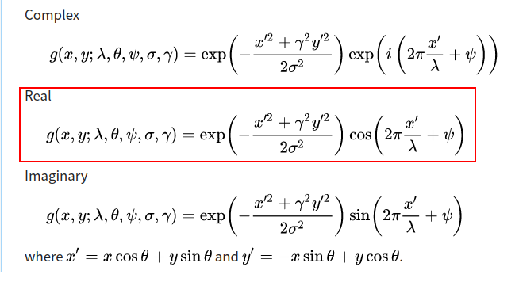
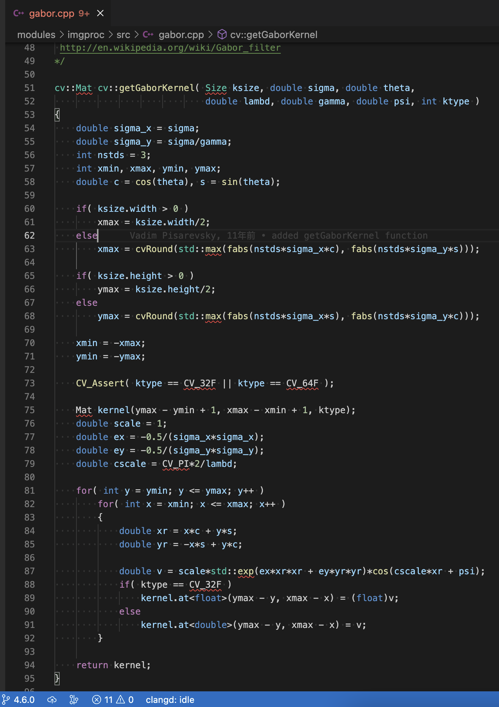
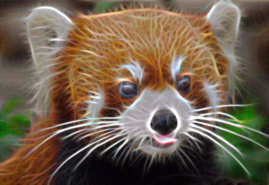
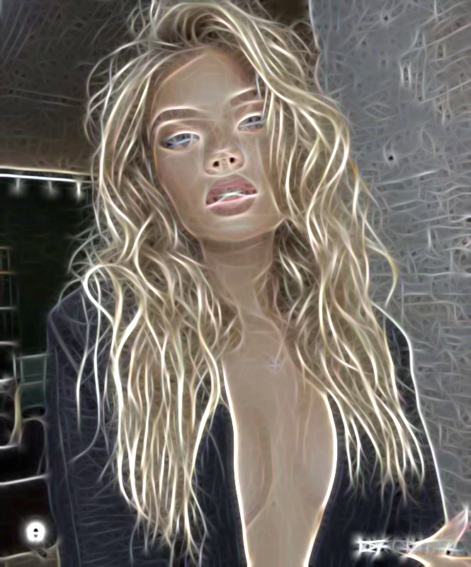
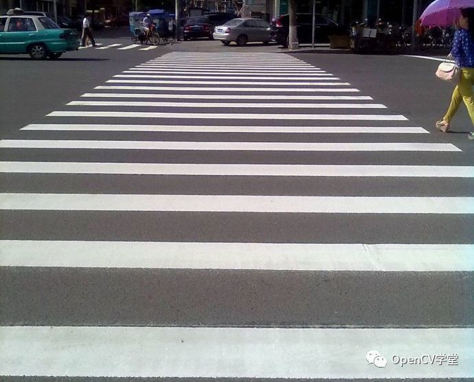
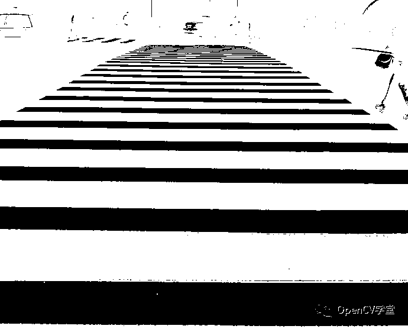

# OpenCV获取和使用Gabor滤波器

## 0x1 目的
Gabor filter 用于获取图像的纹理特征。之前没接触过， 这里简要记录。

## 0x2 公式
https://en.wikipedia.org/wiki/Gabor_filter



Gabor filter 的公式由两部分组成， 第一部分是高斯核， 也就是 `exp(...)` 这部分； 第二部分则是根据数据类型有所不同， `cv::getGaborKernel()` 用的是实数情况的， 也就是上图中红框框出来的， 于是使用了 `cos(...)` 这部分的计算。

## 0x3 代码实现中的赋值顺序问题
Gabor filter 算法是用它特有的 kernel 在 图像上做卷积计算， 因此 `cv::getGaborKernel()` 得到的是一个用 `cv::Mat` 表示的 kernel。 换言之， wikipedia 中给出的公式仅仅是 kernel 中单个点的计算公式， 需要套上 x 和 y 两个方向各自的循环才能得到完整的 kernel。



`getGaborKernel()` 的实现和常规的对 `cv::Mat` 的赋值顺序正好相反（两个维度都相反）， 不符合平时的习惯：
```c++
for (int i = 0; i < height; i++)
{
    for (int j = 0; j < width; j++)
    {
        mat.ptr<T>(i, j)[0] = value; // 我习惯的常规写法
        mat.ptr<T>(height-1-i, width-1-j)[0] = value; // getGaborKernel()的写法
    }
}
```

这里的原因， 和 `cv::Sobel()` 相关的 `cv::getDerivKernel()` 一样， 返回的是 kernel 是要和 `cv::filter2D()` 搭配使用， 按数学公式这个搭配使用的操作是数字信号中的卷积， 而 `cv::filter2D()` 其实是按 correlation 方式计算的， 因此 `cv::getDerivKernel()` 和 `cv::getGaborKernel()` 返回的都是 reverse 过的 kernel。

也就是说这里 `cv::getGaborKernel()` 的倒序给 kernel 赋值， 使得后续省却了 `cv::flip(kernel, kernel, -1)` 的操作， 直接调用 `cv::filter2D()`, 就得到和理论公式中卷积的结果了。

## 0x4 Gabor filter 算法效果
### 魔幻光影滤镜
```c++
// 魔幻光影滤镜
// https://zhuanlan.zhihu.com/p/33311557
#include <opencv2/opencv.hpp>

static std::vector<cv::Mat> build_filters()
{
    std::vector<cv::Mat> filters;
    const int ksize = 31;
    const double sigma = 4.0;
    const double lambd = 10.0;
    const double gamma = 0.5;
    const double psi = 0;
    // 此处创建16个滤波器， 只有 getGaborkernel 的第三个参数 theta 不同
    for (int i = 0; i < 16; i++)
    {
        double theta = CV_PI * i / 16;
        cv::Mat kernel = cv::getGaborKernel(cv::Size(ksize, ksize), sigma, theta, lambd, gamma, psi, CV_32F);
        kernel /= 1.5 * cv::sum(kernel)[0];
        filters.emplace_back(kernel);
    }
    return filters;
}

cv::Mat process(const cv::Mat& src, std::vector<cv::Mat>& filters)
{
    cv::Mat accum = cv::Mat::zeros(src.size(), src.type());
    for (cv::Mat kernel: filters)
    {
        cv::Mat fimg;
        {
            AutoTimer timer("filter2D");
            cv::filter2D(src, fimg, CV_8UC3, kernel); // 这里是耗时的瓶颈
        }
        {
            AutoTimer timer("getmax");
            accum = cv::max(accum, fimg);
        }
    }
    return accum;
}

int main()
{
    cv::Mat src = cv::imread(image_path);
    std::vector<cv::Mat> filters = build_filters();
    cv::Mat res = process(src, filters);
}
```

小熊猫原图：


应用 gabor filter 后：


美女原图：


应用 gabor filter 后：



### 检测斑马线
```c++
// https://cloud.tencent.com/developer/article/1165871

#include <opencv2/core.hpp>
#include <opencv2/opencv.hpp>
int main()
{
    // const std::string image_path = "texture1.png";
    const std::string image_path = "zebra.jpeg";
    cv::Mat src = cv::imread(image_path, cv::IMREAD_GRAYSCALE);
    cv::imshow("input", src);
    cv::Mat src_f;
    src.convertTo(src_f, CV_32F);

    // 参数初始化
    int kernel_size = 3;
    double sigma = 1.0;
    double lambd = CV_PI / 8;
    double gamma = 0.5;
    double psi = 0;
    std::vector<cv::Mat> destArray;
    double theta[4];
    cv::Mat temp;

    // theta 法线方向
    theta[0] = 0;
    theta[1] = CV_PI / 4;
    theta[2] = CV_PI / 2;
    theta[3] = CV_PI - CV_PI / 4;

    // gabor 纹理检测器, 可以更多
    // filters = number of thetas * number of lambd
    // 这里 lambd 只取一个值， 所有4个filter
    for (int i = 0; i < 4; i++)
    {
        cv::Mat kernel1;
        cv::Mat dest;
        cv::Size ksize(kernel_size, kernel_size);
        kernel1 = cv::getGaborKernel(ksize, sigma, theta[i], lambd, gamma, psi, CV_32F);
        cv::filter2D(src_f, dest, CV_32F, kernel1);
        destArray.emplace_back(dest);
    }

    // 显示与保存
    cv::Mat dst1, dst2, dst3, dst4;
    
    cv::convertScaleAbs(destArray[0], dst1);
    cv::imwrite("gabor1.jpg", dst1);

    cv::convertScaleAbs(destArray[1], dst2);
    cv::imwrite("gabor2.jpg", dst2);

    cv::convertScaleAbs(destArray[2], dst3);
    cv::imwrite("gabor3.jpg", dst3);
    
    cv::convertScaleAbs(destArray[3], dst4);
    cv::imwrite("gabor4.jpg", dst4);

    // 合并结果
    cv::add(destArray[0], destArray[1], destArray[0]);
    cv::add(destArray[2], destArray[3], destArray[2]);
    cv::add(destArray[0], destArray[2], destArray[0]);
    cv::Mat dst;
    cv::convertScaleAbs(destArray[0], dst, 0.2, 0);

    // 二值化显示
    cv::Mat gray, binary;
    cv::threshold(dst, binary, 0, 255, cv::THRESH_BINARY_INV | cv::THRESH_OTSU);
    cv::imshow("result", dst);
    cv::imshow("binary", binary);
    cv::imwrite("zebra_result.png", binary);
    cv::waitKey(0);

    return 0;
}
```





## 0x5 References
- https://en.wikipedia.org/wiki/Gabor_filter
- [魔幻光影滤镜（2）：仿Redfield Fractalius滤镜](https://zhuanlan.zhihu.com/p/33311557)
- https://www.cnblogs.com/sakuraie/p/13341474.html
- https://cloud.tencent.com/developer/article/1165871