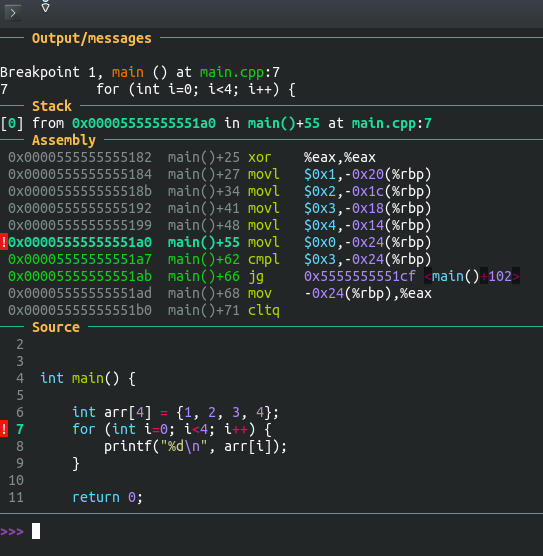

## gdb 资料

官方资料
- 官网 https://sourceware.org/gdb
- 文档： https://sourceware.org/gdb/current/onlinedocs/gdb.pdf
- wiki： https://sourceware.org/gdb/wiki/

视频教程
- https://www.bilibili.com/video/BV1EK411g7Li  清晰易懂的入门tutorial

调试原理举例
- https://zhuanlan.zhihu.com/p/336922639


## 配置 gdb

gdb 配置文件是 `~/.gdbinit` ，gdb 带 Python 支持情况下（例如 ubuntu 20.04 apt 装的 gdb 9.2），配置文件中可以使用 Python 进行配置。

我用的是 [dashboard](https://github.com/cyrus-and/gdb-dashboard/)，拷贝到个人 `~/.gdbinit` , 并稍作布局的修改:

```
dashboard -layout stack assembly source !variables
```



## gdb 调试， level 1

### 编译阶段：开启符号信息

打开 `-g` 参数：

```bash
g++ main.cpp -g
```

如果是 CMake 的构建，可以简单设定为：
```cmake
set(CMAKE_BUILD_TYPE Debug)
```

注意到 `CMAKE_BUILD_TYPE=Debug` 是组合了 `-g` 和 不带优化开关等编译选项，也可以只开符号信息：
```cmake
set(CMAKE_C_FLAGS "${CMAKE_C_FLAGS} -g")
set(CMAKE_CXX_FLAGS "${CMAKE_CXX_FLAGS} -g")
```

### 调试开始：加载文件

- 直接加载二进制：
```bash
gdb a.out             # 加载二进制文件，一切都没有执行处于最开始
```

- 加载二进制和 core 文件：
```bash
ulimit -c unlimited   # 允许生成 core 文件
./a.out               # 运行一个能触发 segfault 的二进制，会生成 core 文件
gdb ./a.out core      # 加载二进制和 core 文件，处于 segfault 事发现场
```

- 附加到进程
```bash
gdb program 1234
gdb -p 1234
```


### 调试命令

**普通断点**

- `b 函数名`
- `b 行号`

**watchpoint** 

当表达式的值变化时，就停下来，也叫做 data breakpoint

- `watch 表达式`

**运行**

`r` 或 `run`

**执行下一行（函数级）**

`s` 或 `step`

**执行下一个指令（汇编级）**

`si`

**打印变量**

常规打印： `p 变量名`

16进制显示： `p/x 变量名`

**退出gdb**

`q` 或 `quit`

**执行shell命令**

- `shell pwd`
- `shell cat ~/.pathrc`


## gdb 调试， level 2

### argv 传参

```bash
gdb --args ./a.out  arg1  arg2
```

```
$ gdb executablefile
(gdb) r arg1 arg2 arg3
```

```
(gdb) set args arg1 arg2
(gdb) show args
```

### 多个源文件时

**指定断点**
```gdb
b file1.cpp: linenum
```

**路径切换**

不同文件夹中的文件， 可以用 directory 命令修改路径

```gdb
(gdb) directory ../test1/
Source directories searched: /mnt/hgfs/share/C++/GDB/ManyFiles/../test1:$cdir:$cwd 
(gdb) b test1.cpp:2
Breakpoint 1 at 0x4008b2: file ../test1/test1.cpp, line 2.
(gdb) r
Starting program: /mnt/hgfs/share/C++/GDB/ManyFiles/test 

Breakpoint 1, test1 () at ../test1/test1.cpp:5
5    cout<<"test1"<<endl;
(gdb) info b
Num     Type           Disp Enb Address            What
1       breakpoint     keep y   0x00000000004008b2 in test1() at ../test1/test1.cpp:2
breakpoint already hit 1 time
(gdb) 
```

## gdb 调试， level 3

### 调试中，修改变量

```gdb
p var=233
```

```gdb
set var cnt=233
```


实例：
```
>>> p number=233
$2 = 233
>>> p number
$3 = 233
>>> set var cnt=20
>>> p cnt
$4 = 20
```

### 反向调试

进 gdb 后，执行 `record` 以开始记录
```
b main
run
record
```

单步调试时，想回到上一步：
```
s  # 单步
reverse-step   # 反向单步
```

注意：
- 并非所有平台的gdb都支持 reverse debugging
- 支持的命令包括：
```
reverse-continue:  反向执行直到遇到停止事件(例如 breakpoint, watchpoint, or exception). 

reverse-step: 反向运行程序，直到上一条执行的源码开始的那一行. 

reverse-stepi: 反向运行程序，指令级别

reverse-next: 反向执行函数级别的调用

reverse-nexti: 反向执行单条机器指令，如果那条指令是 return， 则整个函数被反向执行

reverse-finish: 反向执行，直到调用的函数

set exec-direction [forward | reverse] ： 模式设定函数，当设定为 reverse 后，诸如 step, continue 这样的命令，都被反向执行
```

## gdb 调试， level 4

### Q1: 多次执行 list，发现看不到当前断点代码行了。咋办？

用 `where` 命令，查看当前断点所在的行。然后结合 VSCode 查看。

或，`frame` 命令后，再执行 `list`.

要更精确的显示（前后多现实若干行），则使用 `list *$rip`

参考: [gdb: how to print the current line or find the current line number?](https://stackoverflow.com/questions/14581837/gdb-how-to-print-the-current-line-or-find-the-current-line-number)

### TODO

1. 切换 frame / call stack ?
2. 多文件时，编辑器 、 IDE 集成支持？
3. 修改变量？


### CLion

问题1：
在 debug 模式下，在 lldb 窗口，用命令增加了断点，但是在GUI界面中并没有显示出来

问题2：
在断点处，没法直接用鼠标查看对应的汇编，需要手动在lldb窗口手动敲 dis 来查看

