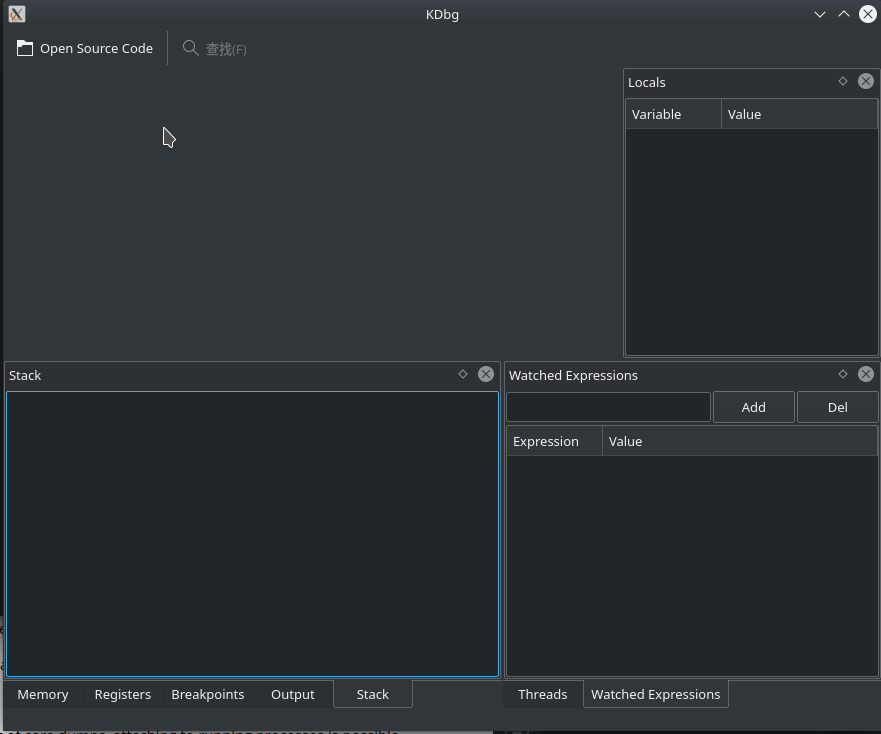

## 0x1. 下载 kdbg 源码

apt 里没有 kdbg， 需要从官网下载源码编译

https://www.kdbg.org/

我下载的是 kdbg-3.0.1 版本

## 0x2. 编译安装

### 依赖问题
kdbg 是基于 CMake 构建的，确保安装了 cmake （并且版本最好新一点，我用的 3.20）。

第一次编译， cmake 失败了，写到 log 里看看：
```bash
mkdir build
cd build
cmake .. -DCMAKE_BUILD_TYPE=Release -DCMAKE_INSTALL_PREFIX=/home/zz/soft/kdbg > log.txt 2>&1
```

log 里关键两条报错：
```
-- Could NOT find KF5IconThemes (missing: KF5IconThemes_DIR)                                                 
-- Could NOT find KF5XmlGui (missing: KF5XmlGui_DIR)                                                         
```

解决办法：
```bash
sudo apt install libkf5iconthemes-dev libkf5xmlgui-dev
```

### 编译安装
重新来，完整的构建：
```
cmake .. -DCMAKE_BUILD_TYPE=Release -DCMAKE_INSTALL_PREFIX=/home/zz/soft/kdbg
make -j8
make install
```

改 PATH：
`vim ~/.pathrc`:
```bash
KDBG_BIN=/home/zz/soft/kdbg/bin
export PATH=$KDBG_BIN:$PATH
```

新开终端，输入 kdb 命令，打开看到：



添加桌面应用快速查找：
```
cd /usr/share/applications
sudo vim kdbg.desktop
[Desktop Entry]
Name = kdbg
Comment = kdbg
Exec=/home/zz/soft/kdbg/bin/kdbg
Icon=/home/zz/soft/kdbg/share/icons/hicolor/16x16/apps/kdbg.png
Terminal=false
Type=Application
```
则后续在“开始菜单”输入 kdbg 即可找到并打开 kdbg。

**Note** 由于 kdbg 无法加载 a.out 可执行文件（没找到加载的按钮，File那里试了无效），放弃。。

## 0x3. KDevelop 配置

KDevelop 创建的工程，直接支持 CMake 的工程。感觉还可以。

开启行号：


添加断点：
https://docs.kde.org/trunk5/en/kdevelop/kdevelop/debugging-programs-in-kdevelop.html

(KDevelop 相比于 kdbg 的进步在于，确实可以写代码、编译程序了。)

探索了一下，仍然无法真的调试起来，毫无反应。放弃。。

## 0xx References

- [Trying to install KDbg debugger](https://askubuntu.com/questions/1235242/trying-to-install-kdbg-debugger)