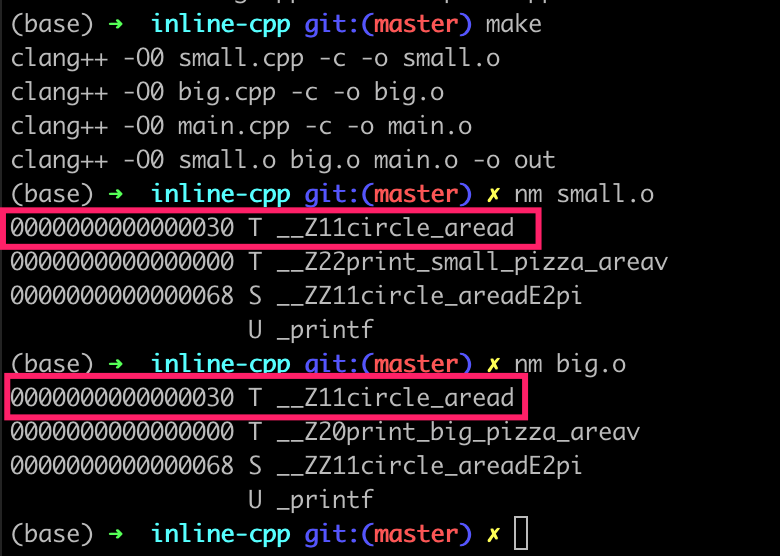
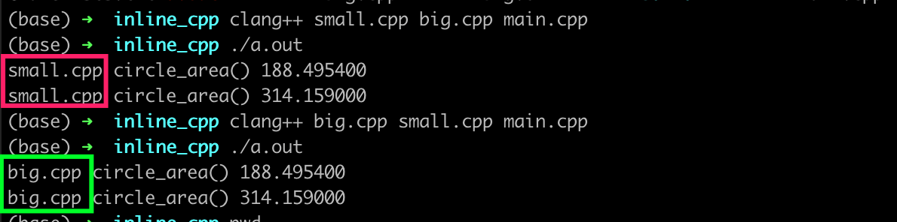

# 浅谈 C++ 中的 inline (1)

inline 是 C 语言和 C++ 中的关键字，中文通常翻译为“内联”。关于 inline 的讨论有不少，其中不乏一些深入人心（大雾）的错误认识。本文尝试列出这些观点，搭配具体的例子和简单分析，一一说明。

## 0x1. C 和 C++ 的 inline 用法一样吗？

**答案是不一样，或者说不完全一样。**

这里给出例子:在 util.h 中定义内联函数 `inline double circle_area()` 的定义，在 small.c 和 big.c 中定义的函数里进行调用，在 main.c 中进一步调用 small.c 和 big.c 中定义的函数。（例子来源是 [Dangers of linking inline functions](https://gudok.xyz/inline/) ）

使用 ubuntu 下的 clang 13.0 编译器，限定 O0 优化等级的前提下，源码文件用 `.c` 作为后缀会报链接错误，源码文件保存为 `.cpp` 则链接通过。具体代码如下：

### 例子 1.1
`util.h`:
```c++
#ifndef ZZ_UTIL_H
#define ZZ_UTIL_H

inline double circle_area(double r)
{
    static const double pi = 3.14159;
    return 2.0 * pi * r;
}

#endif // ZZ_UTIL_H
```

`small.c`:
```c++
#include "util.h"
#include <stdio.h>

void print_small_pizza_area() {
    printf("%f\n", circle_area(30));
}
```

`big.c`:
```c++
#include "util.h"
#include <stdio.h>

void print_big_pizza_area() {
    printf("%f\n", circle_area(50));
}
```

`main.c`:
```c++
void print_big_pizza_area();
void print_small_pizza_area();

int main() {
    print_small_pizza_area();
    print_big_pizza_area();

    return 0;
}
```

`makefile`
```makefile
default_target: out

CFLAGS = -O0

small:
    clang ${CFLAGS} small.c -c -o small.o

big:
    clang ${CFLAGS} big.c -c -o big.o

main:
    clang ${CFLAGS} main.c -c -o main.o

out: small big main
    clang ${CFLAGS} small.o big.o main.o -o out

.PHONY: clean
clean:
    rm *.o
```

执行编译，会看到链接报错，提示说 `circle_area` 符号没有找到：
```
(base) zz@home% clang --version
clang version 13.0.0 (/home/zz/work/github/llvm-project dc672999a9b12a156991891dc400308b52d569ba)
Target: x86_64-unknown-linux-gnu
Thread model: posix
InstalledDir: /home/zz/soft/llvm13/bin
(base) zz@home% make
clang -O0 small.c -c -o small.o
clang -O0 big.c -c -o big.o
clang -O0 main.c -c -o main.o
clang -O0 small.o big.o main.o -o out
/usr/bin/ld: small.o: in function `print_small_pizza_area':
small.c:(.text+0xd): undefined reference to `circle_area'
/usr/bin/ld: big.o: in function `print_big_pizza_area':
big.c:(.text+0xd): undefined reference to `circle_area'
clang-13: error: linker command failed with exit code 1 (use -v to see invocation)
make: *** [makefile:15：out] 错误 1
```

### 例子 1.2

新建工程目录，把上述涉及的文件全部拷贝，`.c` 后缀改为 `.cpp`， makefile 也做相应修改（但注意，仍然用 O0 优化等级）：

```makefile
default_target: out

CFLAGS = -O0

small:
    clang++ ${CFLAGS} small.cpp -c -o small.o

big:
    clang++ ${CFLAGS} big.cpp -c -o big.o

main:
    clang++ ${CFLAGS} main.cpp -c -o main.o

out: small big main
    clang++ ${CFLAGS} small.o big.o main.o -o out

.PHONY: clean
clean:
    rm *.o
```

程序构建的命令输出：
```
(base) zz@home% clang++ --version
clang version 13.0.0 (/home/zz/work/github/llvm-project dc672999a9b12a156991891dc400308b52d569ba)
Target: x86_64-unknown-linux-gnu
Thread model: posix
InstalledDir: /home/zz/soft/llvm13/bin
(base) zz@home% make             
clang++ -O0 small.cpp -c -o small.o
clang++ -O0 big.cpp -c -o big.o
clang++ -O0 main.cpp -c -o main.o
clang++ -O0 small.o big.o main.o -o out
```

**同一份包含inline函数的代码，文件后缀从 .c 改成 .cpp，就把链接报错改掉了！** 乍一看，确实有点神奇。这里不去深究为什么改为 .cpp 后就消除了链接错误，只需要注意一点：讨论 inline 关键字的用法，应该区分 C语言和 C++ 分别讨论。

## 0x2. 现代编译器里对 inline 关键字，鸟都不鸟？

在某卷卷群讨论 inline 的用法时候， [Anime4KCPP](https://github.com/TianZerL/Anime4KCPP) 的作者认为：

> 在现代编译器里 inline 只是相当于弱链接指示符；内联指示这个功能，编译器鸟都不鸟

这个关键简单粗暴，看起来也便于记忆；然而并不完全正确。**现代编译器还是会看 inline 关键字的，不是完全不理会**。下面给出具体例子。

### 例子 2.1

新建 `hello.cpp`， 定义 `add` 函数实现两个整数加法。首先是不带 `inline` 的版本：
```c++
#include <iostream>

int add(int a, int b) {
    return a + b;
}

int main() {
    int sum = add(1, 2);
    std::cout << sum << std::endl;

    return 0;
}
```

仍然使用 Ubuntu 20.04 和 clang 13.0 的构建环境，输出如下：
```
(base) zz@home% clang++ hello.cpp -O0
(base) zz@home% clang++ hello.cpp -O0 -c -o hello.o
(base) zz@home% nm hello.o 
                 U __cxa_atexit
0000000000000000 t __cxx_global_var_init
                 U __dso_handle
0000000000000040 t _GLOBAL__sub_I_hello.cpp
0000000000000020 T main
0000000000000000 T _Z3addii
                 U _ZNSolsEi
                 U _ZNSolsEPFRSoS_E
                 U _ZNSt8ios_base4InitC1Ev
                 U _ZNSt8ios_base4InitD1Ev
                 U _ZSt4cout
                 U _ZSt4endlIcSt11char_traitsIcEERSt13basic_ostreamIT_T0_ES6_
0000000000000000 b _ZStL8__ioinit
```

简单解释：`clang++ hello.cpp -O0 -c -o hello.o` 意思是编译（并不链接）为 hello.o 文件，优化等级为 O0；`nm hello.o` 则是使用二进制分析工具 `nm` 查看 hello.o 里的符号等信息。简单复习一下 `nm` 命令，C/C++ 的每个函数，编译后对应一个符号（symbol），`nm` 列出的每一行是一个符号，中间一列是符号类型：

- `T` 全局符号
- `t` 局部符号
- `W` 全局弱符号

找到我们定义的 `add` 函数对应的符号行：

```
0000000000000000 T _Z3addii
```

类型为 `T`，说明是全局符号（全局函数）。这是 O0 情况下的结果；如果是 O3 优化等级下，符号能否被优化掉，然后就地展开？

```
(base) zz@home% clang++ hello.cpp -O3 -c -o hello.o
(base) zz@home% nm hello.o                         
                 U __cxa_atexit
                 U __dso_handle
0000000000000000 t _GLOBAL__sub_I_hello.cpp
0000000000000010 T main
0000000000000000 T _Z3addii
                 U _ZNKSt5ctypeIcE13_M_widen_initEv
                 U _ZNSo3putEc
                 U _ZNSo5flushEv
                 U _ZNSolsEi
                 U _ZNSt8ios_base4InitC1Ev
                 U _ZNSt8ios_base4InitD1Ev
                 U _ZSt16__throw_bad_castv
                 U _ZSt4cout
0000000000000000 b _ZStL8__ioinit

(base) zz@home% clang++ hello.o -o hello
(base) zz@home% nm hello | ag 'add'     
00000000004011c0 T _Z3addii
```


### 例子 2.2

可以看到开了 O3 之后， clang 仍然保留了 add 对应的符号 `_Z3addii`，并没有内联展开。基于例子2.1，**头文件.h中定义函数时手动添加inline关键字**，则在 O1 或更高优化等级下，成功的实现了内联（O0 时仍然不是内联）：

```c++
#include <iostream>

inline int add(int a, int b) {  // 注意这行增加了 inline
    return a + b;
}

int main() {
    int sum = add(1, 2);
    std::cout << sum << std::endl;

    return 0;
}
```

编译链接和查看符号：
```
(base) zz@home% clang++ hello.cpp -o hello.o -O0
(base) zz@home% nm hello.o | ag 'add'
0000000000401220 W _Z3addii
(base) zz@home% clang++ hello.cpp -o hello.o -O1
(base) zz@home% nm hello.o | ag 'add'           
(base) zz@home% 
(base) zz@home% clang++ hello.cpp -o hello.o -O3
(base) zz@home% nm hello.o | ag 'add'           
(base) zz@home% 
```

这个例子说明， 手动添加的 `inline` 关键字仍然起作用（至少对于 Linux 下的 clang 编译器如此）。


### 例子 2.3

那么，不指定 inline 的函数，就一定不被编译器执行 inline 行为了吗？对上述例子稍作修改，用 `static` 修饰，在 O1 情况下，能够被编译器内联展开：
```c++
#include <iostream>

static int add(int a, int b) {
    return a + b;
}

int main() {
    int sum = add(1, 2);
    std::cout << sum << std::endl;

    return 0;
}
```

```
(base) zz@home% clang++ hello.cpp -O0 -c -o hello.o
(base) zz@home% nm hello.o | ag 'add'              
0000000000000050 t _ZL3addii
(base) zz@home% clang++ hello.cpp -O1 -c -o hello.o
(base) zz@home% nm hello.o | ag 'add'              
(base) zz@home% 
```

## 0x3. inline 在现代编译器里 inline 只是相当于弱链接指示符 ？

当同名内联函数（不考虑重载、不考虑模板）的定义，出现在多个翻译单元(.cpp)里时，链接器会怎样选择？这些多次出现的同名符号，被当做弱符号了吗？ **不同编译器下的情况不一样，linux clang确实是弱符号，apple clang是强符号**。所以，这个“弱符号提示符”的观点还是不完全正确。

### 例子 3.1

考虑第 1 节中 `util.h`, `main.cpp`, `small.cpp`, `big.cpp` 的例子:

`util.h`:
```c++
#ifndef ZZ_UTIL_H
#define ZZ_UTIL_H

inline double circle_area(double r)
{
    static const double pi = 3.14159;
    return 2.0 * pi * r;
}

#endif // ZZ_UTIL_H
```

`small.cpp`
```c++
#include "util.h"
#include <stdio.h>

void print_small_pizza_area() {
    printf("%f\n", circle_area(30));
}
```

`big.cpp`:
```c++
#include "util.h"
#include <stdio.h>

void print_big_pizza_area() {
    printf("%f\n", circle_area(50));
}
```

`main.cpp`:
```c++
void print_big_pizza_area();
void print_small_pizza_area();

int main() {
    print_small_pizza_area();
    print_big_pizza_area();

    return 0;
}
```

在 Ubuntu 下的编译链接输出如下， `nm` 找到的 `circle_area` 函数对应的符号是 `_Z11circle_aread`（用 `c++filt` 反向验证正确），`W` 表明 inline 的修饰，被处理为全局弱符号：
```
(base) zz@home% make
clang++ -O0 small.cpp -c -o small.o
clang++ -O0 big.cpp -c -o big.o
clang++ -O0 main.cpp -c -o main.o
clang++ -O0 small.o big.o main.o -o out
(base) zz@home% nm small.o              
0000000000000000 r .LCPI0_0
0000000000000008 r .LCPI1_0
                 U printf
0000000000000000 W _Z11circle_aread           ## 这一行，是 circle_area 对应的符号
0000000000000000 T _Z22print_small_pizza_areav
0000000000000000 V _ZZ11circle_areadE2pi
(base) zz@home% c++filt _Z11circle_aread
circle_area(double)
```

而在 MacOSX 下，编译器使用 XCode 自带的 AppleClang 12.0.0，编译后查看符号，发现 `circle_area` 内联函数对应的符号并不是弱符号，而是全局符号（`T`）：




### 例子 3.2

进一步实验，把 `util.hpp` 拿掉，分别放到 `small.cpp` 和 `big.cpp` 中，并且分别修改函数实现使得有所差异。也就是：在半天的 .cpp 中，定义相同的 inline 函数（但不是 static），但具体实现又有所差异（显然实际工程中应该避免这样的情况，这里仅仅是举例说明危害）：

`small.cpp`:
```c++
//#include "util.h"
#include <cstdio>

inline double circle_area(double r)
{
    printf("small.cpp circle_area() ");
    static const double pi = 3.14159;
    return 2.0 * pi * r;
}

void print_small_pizza_area()
{
    printf("%f\n", circle_area(30));;
}
```

`big.cpp`
```c++
//#include "util.h"
#include <cstdio>

inline double circle_area(double r)
{
    printf("big.cpp circle_area() ");
    static const double pi = 3.14159;
    return 2.0 * pi * r;
}

void print_big_pizza_area()
{
    printf("%f\n", circle_area(50));
}
```

`main.cpp` 保持不变；在 AppleClang 编译器下，不同编译顺序导致链接到不同的 `circle_area` 实现：
```bash
(base) ➜  inline_cpp clang++ small.cpp big.cpp main.cpp
(base) ➜  inline_cpp ./a.out
small.cpp circle_area() 188.495400
small.cpp circle_area() 314.159000
(base) ➜  inline_cpp clang++ big.cpp small.cpp main.cpp
(base) ➜  inline_cpp ./a.out
big.cpp circle_area() 188.495400
big.cpp circle_area() 314.159000
```



而同样的代码，开启 O1 或更高的优化时，由于真正的做了“就地替换”的 inline 行为，避免了链接阶段的符号冲突和混乱链接（不同链接器顺序不一样），使得得到了符合预期的输出：
```
(base) zz@home% clang++ big.cpp small.cpp main.cpp -O3
(base) zz@home% ./a.out 
small.cpp circle_area() 188.495400
big.cpp circle_area() 314.159000
```

这个例子一定程度上演示了，怎样构造一个“相同代码，但 Debug 模式和 Release 模式运行输出不一致” 的具体例子；实际项目中见过类似的糟糕写法，在不同的 .cpp 中分别实现了时间打印函数，但打印内容不甚相同，给调试过程增加了不必要的干扰。

## 0x4. 小结

本文通过给出具体的可运行代码，和在 linux、macosx 平台上分别测试，对 inline 函数的一些看法做了验证，得到一些结论：
- 1. C 的 inline 和 C++ 的 inline 不一样
- 2. 现代 C++ 编译器看一个函数，如果没有 inline 关键字，可能不做 inline 展开，也可能做（例如 static 函数），而不是 “鸟都不鸟” inline 关键字
- 3. 多个翻译单元中的同名非 static 的 inline 函数，可能被当做全局弱符号，也可能是全局强符号
- 4. inline 函数应该老老实实在 .h 中定义，而不是为了赶时间手动拷贝到不同的 .cpp 中并顺手修改，以免造成 Debug / Release 模式下结果不同

涉及的代码，上传到了

https://gitee.com/aczz/cv-dbg/tree/master/inline-cpp

## 0x5. References

- [Dangers of linking inline functions](https://gudok.xyz/inline/)
