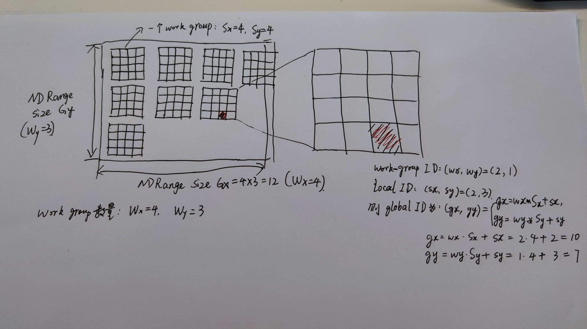
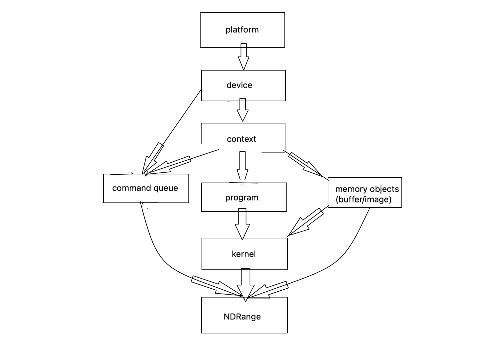

# OpenCL 入门: NDRange 的可视化理解

## 0x1 从执行 Kernel 说起
在 OpenCL 中使用 `clEnqueueNDRangeKernel()` 这一 API 来“启动执行 kernel”。相比于 CUDA 中调用 kernel 函数时用类似模板参数的写法显式写出两个数字， `clEnqueueNDRangeKernel()` 这一 API 显得没那么友好：
- 要填入很多参数， 未免有点罗嗦
- 填入数字后， 表达的是什么含义， 是否有可视化解释？
- 对于填入的 global size 和 local size， 对应的可视化解释， 能否用程序验证？

对于前两个疑惑/问题， 很多书籍教材博客中都有给出解释和图示。 然而（从初学者视角看）最让人信服和需要的， 是通过程序运行来验证这些概念和数值。

## 0x2 NDRange 的图示

很多教程书籍里用的图示中， work group 数量设置为了 Wx = Wy. 这未免让人容易弄混。 我手绘了 Wx=4, Wy=3 的不想等的情况， 如下图， 每个 local 区域大小是 4x4, 并标记了其中一个 local 里的最后一行倒数第二个格子为红色：



上图中每个格子其实就是一个 work-item， 其实就是线程的意思。为了准确描述红色小格子的所在位置， 使用相关的变量定义说明如下：
- NDRange Size: (Gx, Gy) = (16, 12), 表示的是 global size
- work group 数量: (Wx, Wy) = (4, 3), 表示在 x 方向有4个 work group, 在 y 方向有3个 work group
- local size: (Sx, Sy) = (4, 4), 表示每个 work group 大小是 4 x 4
- 红色小格子的 local id 为 (sx, sy) = (2, 3), 指的是在当前的 work group 里的坐标
- 红色小格子的 global id 为 (gx, gy) = (10, 7) = (wx * Sx + sx, wy * Sy + sy), 表示在整个 NDRange 里的坐标

## 0x3 在 OpenCL kernel 里打印: printf 的使用
相比于 CPU 上的代码， OpenCL Kernel 代码没有什么调试工具可用， 不过 printf 暴力输出大法仍然是奏效的。

相比于平时用的 printf， OpenCL Kernel 中的 printf 的语法是一样的， 不过我遇到的坑是， 如果在 printf 打印输出的同一行语句中， 用一个计算表达式的结果作为 format 字符串的的一个参数， 打印结果可能不符合预期。

换言之， 先算好结果存储到变量中， 再用 printf 打印， 这是我在 OpenCL Kernel 中打印时的第一个经验。

## 0x4 在 OpenCL kernel 里打印： 验证结果
这里稍微设计了一下， 传给 kernel 的是一个一维数组， 里面只有一个元素设置为了 255 的取值， 其他都为0, 在判断当前线程对应的数据为255时（也就是前面手绘图示中红色格子）， 打印输出定义应的 global id, global size, local id, local size, group id, num groups 等 meta 信息。

kernel 代码如下：
```c
// 在 kernel 里判断， 当元素取值为255时， 打印 global id, local id, global size, local size 等。
const char* kernel_str = CL_KERNEL(
    __kernel void test(__global const int* data)
    {
        int work_dim = get_work_dim();

        char symbols[3] = {'x', 'y', 'z'};

        int idx;
        {
            int j = get_global_id(0);
            int i = get_global_id(1);
            int width = get_global_size(0);
            int height = get_global_size(1);
            idx = i * width + j;
        }
        if (data[idx] == 255)
        {
            printf("global id:");
            for (int k = 0; k < 3; k++)
            {
                int global_id = get_global_id(k);
                char ch = symbols[k];
                printf(" g%c=%d", ch, global_id);
            }
            printf("\n");

            printf("global size:");
            for (int k = 0; k < work_dim; k++)
            {
                char ch = symbols[k];
                int global_size = get_global_size(k);
                printf(" G%c=%d", ch, global_size);
            }
            printf("\n");

            printf("local id:");
            for (int k = 0; k < work_dim; k++)
            {
                int local_id = get_local_id(k);
                char ch = symbols[k];
                printf(" s%c=%d", ch, local_id);
            }
            printf("\n");
            
            printf("local size(group size)");
            for (int k = 0; k < work_dim; k++)
            {
                char ch = symbols[k];
                int local_size = get_local_size(k);
                printf(" S%c=%d", ch, local_size);
            }
            printf("\n");

            printf("group id:");
            for (int k = 0; k < work_dim; k++)
            {
                char ch = symbols[k];
                int group_id = get_group_id(k);
                printf(" w%c=%d", ch, group_id);
            }
            printf("\n");

            printf("num groups:");
            for (int k = 0; k < work_dim; k++)
            {
                char ch = symbols[k];
                int num_groups = get_num_groups(k);
                printf(" W%c=%d", ch, num_groups);
            }
            printf("\n");
        }
    }
);
```

## 0x5 OpenCL 程序执行的一般流程
写道 0x4 的时候， 如果你对 OpenCL 程序的基本流程熟悉， 就可以直接运行了。 而如果是还不太清楚， 也没关系， 其实就是按下图所示， 在创建 kernel 前做一些准备工作， 把 platform、 device、 context、 command queue、 memory object 等都准备好， 然后去执行 kernel； 并且注意在 kernel 执行后， 释放这些 OpenCL objects 的先后顺序。



基于上面的流程图， 再对照网络上经典的 “执行两个数组相加的” 的 OpenCL 教程代码， 很容易想到把罗嗦的 OpenCL 调用进行封装。 我将相关 API 封装后， 执行上述 NDRrange 验证的 kernel 的代码如下：
```c++

// 用于验证 NDRange 里的 local ID, group size, group ID, global ID 等相关概念，用计算结果进行验证
// 对照 ndrange_index_illustration.jpg 比对
int main()
{
    // step1~step6: create kernel
    cl_int ret;
    cl_platform_id platform = get_opencl_platform();
    cl_device_id device = get_opencl_device(platform);
    cl_context context = get_opencl_context(platform, device);
    cl_command_queue command_queue = get_opencl_command_queue(context, device, true);
    cl_program program = get_opencl_program_from_string(context, device, kernel_str);
    cl_kernel kernel = clCreateKernel(program, "test", &ret);
    CL_CHECK(ret);

    // step7: create memory objects
    const int width = 16;
    const int height = 12;
    cv::Size size;
    size.width = width;
    size.height = height;
    cv::Mat mat(size, CV_32SC1);
    for (int i = 0; i < height; i++)
    {
        for (int j = 0; j < width; j++)
        {
            mat.ptr<int>(i, j)[0] = 0;
        }
    }
    mat.ptr<int>(7, 10)[0] = 255;

    cl_mem_flags flags = CL_MEM_READ_ONLY | CL_MEM_COPY_HOST_PTR;
    const int bufsize = sizeof(cl_int) * height * width;
    cl_mem cl_a = clCreateBuffer(context, flags, bufsize, mat.data, NULL);


    // step8: set kernel arguments
    ret = clSetKernelArg(kernel, 0, sizeof(cl_mem), &cl_a);
    CL_CHECK(ret);

    // step9~step10: set work group size, run kernel
    size_t global_work_size[] = { (size_t)width, (size_t)height };
    size_t local_work_size[] = { 4, 4 };
    ret = clEnqueueNDRangeKernel(command_queue, kernel, 2, NULL, global_work_size, local_work_size, 0, NULL, NULL);
    CL_CHECK(ret);

    // step11: get result
    // skip

    // step12: release all resources
    release_opencl_objects(kernel, program, command_queue, context);

    return 0;
}
```

