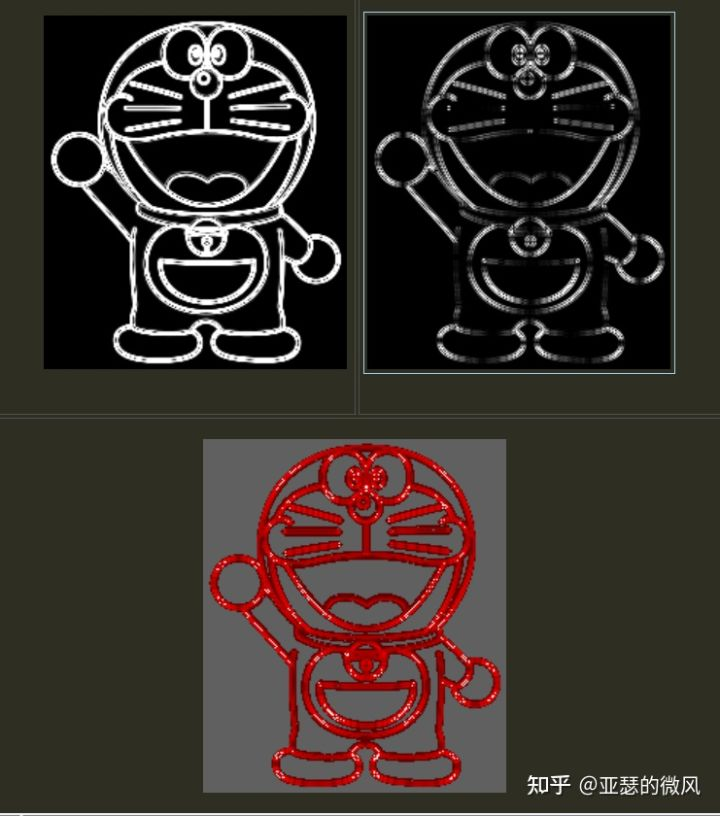
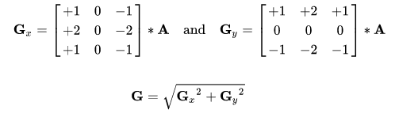
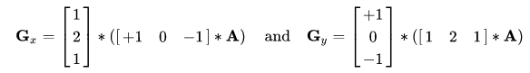

# cv::Sobel() 的正确使用

## 0x1 目的
在对一张灰度图像做 ksize=3x3 的 Sobel 滤波时, 同时考虑 x 方向和 y 方向的一阶导数， 于是写出如下调用：
```c++
cv::Mat grad = cv::Sobel(src, dst, ddepth, dx=1, dy=1, ksize=3);
```
而参考 wikipedia 的公式写出的 naive 实现， 则是另一个结果：
```c++
cv::Mat grad2 = sobel3x3_by_formula(src, dst, ddepth)
```



排查后发现上述 `cv::Sobel()` 调用方式有误， 要得到预期结果需要分别算出 x 和 y 方向的一阶导数后， 再对平方和求方根：
```c++
cv::Mat grad_x = cv::Sobel(src, dst, ddepth, dx=1, dy=0);
cv::Mat grad_y = cv::Sobel(src, dst, ddepth, dx=0, dy=1);
cv::Mat grad = sqrt(gx * gx + gy * gy); 
```

以下展开说明。

## 0x2 基于公式实现 Sobel

### 0x21 3x3 卷积核的公式


公式中的 A 是输入图像， 是和 3x3 矩阵做卷积计算， 这个卷积是数字信号中的卷积定义, 是需要把 3x3 模板中的数据按从后往前的顺序使用， 可以理解为 vector 的 reverse。

容易写出如下 naive 实现：
```c++
void sobel_v1(const cv::Mat& src, cv::Mat& dst, cv::BorderTypes borderType)
{
    std::vector<float> kernel_x_vec =
    {
        1, 0, -1,
        2, 0, -2,
        1, 0, -1
    };

    std::vector<float> kernel_y_vec =
    {
        1, 2, 1,
        0, 0, 0,
        -1, -2, -1
    };

    cv::Mat kernel_x(3, 3, CV_32FC1, kernel_x_vec.data());
    cv::Mat kernel_y(3, 3, CV_32FC1, kernel_y_vec.data());
    cv::flip(kernel_x, kernel_x, -1);
    cv::flip(kernel_y, kernel_y, -1);
    
    using T = float;
    const int ddepth = cv::DataType<T>::depth;

    T* kx0 = kernel_x.ptr<T>(0, 0);
    T* kx1 = kernel_x.ptr<T>(1, 0);
    T* kx2 = kernel_x.ptr<T>(2, 0);

    T* ky0 = kernel_y.ptr<T>(0, 0);
    T* ky1 = kernel_y.ptr<T>(1, 0);
    T* ky2 = kernel_y.ptr<T>(2, 0);

    const int top = 1;
    const int bottom = 1;
    const int left = 1;
    const int right = 1;

    cv::Mat padded_src;
    cv::copyMakeBorder(src, padded_src, top, bottom, left, right, borderType);

    cv::Mat grad;
    grad.create(src.size(), cv::DataType<T>::type);

    for (int i = 0; i < grad.rows; i++)
    {
        for (int j = 0; j < grad.cols; j++)
        {
            uint8_t* sp0 = padded_src.ptr(i + 0, j);
            uint8_t* sp1 = padded_src.ptr(i + 1, j);
            uint8_t* sp2 = padded_src.ptr(i + 2, j);

            T gx = sp0[0] * kx0[0] + sp0[1] * kx0[1] + sp0[2] * kx0[2]
                        + sp1[0] * kx1[0] + sp1[1] * kx1[1] + sp1[2] * kx1[2]
                        + sp2[0] * kx2[0] + sp2[1] * kx2[1] + sp2[2] * kx2[2];

            T gy = sp0[0] * ky0[0] + sp0[1] * ky0[1] + sp0[2] * ky0[2]
                        + sp1[0] * ky1[0] + sp1[1] * ky1[1] + sp1[2] * ky1[2]
                        + sp2[0] * ky2[0] + sp2[1] * ky2[1] + sp2[2] * ky2[2];

            T res = sqrt(gx * gx + gy * gy);
            grad.ptr<T>(i, j)[0] = res;
        }
    }
    dst = grad;
}
```

注意点：
- `cv::flip(kernel, kernel, -1)` 完成了上述 “reverse” 过程
- 边界的处理， 使用了 `cv::copyMakeBorder()` 进行 padding， padding 后再执行真正的 Sobel 计算


### 0x22 可分离 filter 的公式
wikipedia 中还给出了上述公式的等价表达：



于是在具体的实现中， 分别计算出公式中 Gx 的步骤， 可以从原本的一次 3x3 卷积， 改为两次卷积计算， 第一次是 1x3 的 `[1, 0, -1]` 卷积核， 第二次是 `[1; 2; 1]` 的卷积核； 而由于具有交换性， 两次卷积顺序可互换。

简单起见直接调用 `cv::filter2D()` 执行卷积。本次代码实现如下：
```c++
void sobel_v3(const cv::Mat& src, cv::Mat& dst, cv::BorderTypes borderType)
{
    std::vector<float> kx1_vec = {1, 2, 1};
    cv::Mat kx1(3, 1, CV_32FC1, kx1_vec.data());
    
    std::vector<float> kx2_vec = {1, 0, -1};
    cv::Mat kx2(3, 1, CV_32FC1, kx2_vec.data());

    using T = float;
    const int ddepth = cv::DataType<T>::depth;

    cv::Mat grad_x;
    cv::filter2D(src, grad_x, ddepth, kx2.t()); // 需要转置 kx2 !
    cv::filter2D(grad_x, grad_x, ddepth, kx1);


    std::vector<float> ky1_vec = {1, 0, -1};
    cv::Mat ky1(3, 1, CV_32FC1, ky1_vec.data());

    std::vector<float> ky2_vec = {1, 2, 1};
    cv::Mat ky2(3, 1, CV_32FC1, ky2_vec.data());

    cv::Mat grad_y;
    cv::filter2D(src, grad_y, ddepth, ky2.t()); // 需要转置 ky2 !
    cv::filter2D(grad_y, grad_y, ddepth, ky1);

    
    cv::Mat grad(src.size(), cv::DataType<T>::type);
    const int height = src.rows;
    const int width = src.cols;
    for (int i = 0; i < height; i++)
    {
        for (int j = 0; j < width; j++)
        {
            T gx = grad_x.ptr<T>(i, j)[0];
            T gy = grad_y.ptr<T>(i, j)[0];
            grad.ptr<T>(i, j)[0] = sqrt(gx * gx + gy * gy);
        }
    }
    dst = grad;
}
```

## 0x3 cv::Sobel() 的实现

### 0x31 从单元测试找到的 cv::Sobel() 等价实现
从 OpenCV imgproc 模块的 `cv::Sobel()` 的单元测试中找到了等价实现（即结果相同）, 它是先通过 `cv::getDerivKernels()` 获取 x 和 y 方向的 kernel （对应到一阶导数）， 然后再调用 `cv::filter2D()` 得到结果。

```c++
void sobel_from_unittest(const cv::Mat& src, cv::Mat& dst, int dx, int dy, cv::BorderTypes borderType)
{
    int ksize = 3;
    
    cv::Mat kx, ky;
    cv::getDerivKernels(kx, ky, dx, dy, ksize);
    const int ddepth = CV_16S;
    cv::Mat kernel = ky * kx.t();

    std::cout << "=== kx: \n" << kx << std::endl;
    std::cout << "=== ky: \n" << ky << std::endl;
    std::cout << "=== kernel: \n" << kernel << std::endl;

    cv::filter2D(src, dst, ddepth, kernel, cv::Point(-1, -1), 0, borderType);
}
```

调用 `sobel_from_unittest(int dx = 1, int dy = 1)`, 打印发现得到了使用的 kernel 分别是
```
kx = [-1; 0; 1]
ky = [-1; 0; 1]

kernel = [
     1,  0, -1;
     0,  0,  0;
    -1,  0,  1
]
```

这里的 `kx = [-1; 0; 1]` 即是表达了一阶导数也就是差分。

### 0x32 从 getDerivKernels() 源码分析
调用层次关系是：
```
cv::Sobel()
    <- getDerivKernels()
        <- getSobelKernels()
```

当 ksize 小于等于 0， 使用 Scharr 的 kernel； k > 0 时使用 Sobel 的kernel：
```c++
void cv::getDerivKernels( OutputArray kx, OutputArray ky, int dx, int dy,
                          int ksize, bool normalize, int ktype )
{
    if( ksize <= 0 )
        getScharrKernels( kx, ky, dx, dy, normalize, ktype );
    else
        getSobelKernels( kx, ky, dx, dy, ksize, normalize, ktype );
}
```

我们考虑 ksize=3情况， 对应的 `getSobelKernels()` 代码：
```c++
static void getSobelKernels( OutputArray _kx, OutputArray _ky,
                         int dx, int dy, int _ksize, bool 	normalize, int ktype )
{
int i, j, ksizeX = _ksize, ksizeY = _ksize;
if( ksizeX == 1 && dx > 0 )
    ksizeX = 3;
if( ksizeY == 1 && dy > 0 )
    ksizeY = 3;

CV_Assert( ktype == CV_32F || ktype == CV_64F );

_kx.create(ksizeX, 1, ktype, -1, true);
_ky.create(ksizeY, 1, ktype, -1, true);
Mat kx = _kx.getMat();
Mat ky = _ky.getMat();

if( _ksize % 2 == 0 || _ksize > 31 )
    CV_Error( CV_StsOutOfRange, "The kernel size must be odd and not larger than 31" );
std::vector<int> kerI(std::max(ksizeX, ksizeY) + 1);

CV_Assert( dx >= 0 && dy >= 0 && dx+dy > 0 );

for( int k = 0; k < 2; k++ )
{
    Mat* kernel = k == 0 ? &kx : &ky;
    int order = k == 0 ? dx : dy;
    int ksize = k == 0 ? ksizeX : ksizeY;

    CV_Assert( ksize > order );

    if( ksize == 1 )
        kerI[0] = 1;
    else if( ksize == 3 )
    {
        if( order == 0 ) // 0阶导数， 返回 [1, 2, 1]
            kerI[0] = 1, kerI[1] = 2, kerI[2] = 1;
        else if( order == 1 ) // 1 阶导数， 返回 [-1, 0, 1]
            kerI[0] = -1, kerI[1] = 0, kerI[2] = 1;
        else // 其他阶导数， 返回 [1, -2, 1]
            kerI[0] = 1, kerI[1] = -2, kerI[2] = 1;
    }
    else
    {
        int oldval, newval;
        kerI[0] = 1;
        for( i = 0; i < ksize; i++ )
            kerI[i+1] = 0;

        for( i = 0; i < ksize - order - 1; i++ )
        {
            oldval = kerI[0];
            for( j = 1; j <= ksize; j++ )
            {
                newval = kerI[j]+kerI[j-1];
                kerI[j-1] = oldval;
                oldval = newval;
            }
        }

        for( i = 0; i < order; i++ )
        {
            oldval = -kerI[0];
            for( j = 1; j <= ksize; j++ )
            {
                newval = kerI[j-1] - kerI[j];
                kerI[j-1] = oldval;
                oldval = newval;
            }
        }
    }
    Mat temp(kernel->rows, kernel->cols, CV_32S, &kerI[0]);
    double scale = !normalize ? 1. : 1./(1 << (ksize-order-1));
    temp.convertTo(*kernel, ktype, scale);
}
}

}
```

可以观察到： 
- `order` 同时表达了 `dx` 和 `dy`， 也就是说 dx 和 dy 是对偶的
- 当 `order=1` 时， 得到 `[-1, 0, 1]` 的卷积核
- 因此， 当传入 `dx=1, dy=1`  时， 得到两个 `[-1, 0, 1]` 卷积核
- 而如果按 wikipedia 上的公式， 必须是 `dx=1, dy=0` 或 `dx=0, dy=1`, 才能得到正确的卷积核， 即一个是0阶的 `[1, 2, 1]`, 另一个是1阶的 `[-1, 0, 1]`
- 这就解释了为什么 `cv::Sobel(dx=1, dy=1)` 结果和 naive 实现的不一样

## 0x4 cv::Sobel() 的后处理： 根据数据类型和范围进行调整
按前述得到贴合 Sobel 理论公式的结果后， 如果 kernel 本身是 float 类型则 Sobel 结果也是 float 类型， 如果 kernel 选择 int16 类型则 Sobel 结果也是 int16 类型 —— 总之， 超过了输入图像 `src` 本身 uint8 的类型范围。

而我们实际期望得到的结果仍然是一张 uint8 类型范围的图像， 因此需要做类型转换。有这几种做法：

1. 截断， 也就是每个像素用 saturate_cast 转换

2. 按比例缩放后再截断。例如最大元素映射到255， 最小元素映射到0。 需要用到的 API 是 `convertScaleAbs()`:

```c++
CV_EXPORTS_W void convertScaleAbs(InputArray src, OutputArray dst,
                                  double alpha = 1, double beta = 0);
```
它执行的是：
```
dst(I) = saturate_cast<uchar>( | src(I) * alpha + beta | )
```

需要注意的是， 如果是自行实现 Sobel(), 保存结果的 `cv::Mat()` 对象在创建时需要恰当的传入参数以确保所有元素都有正确取值， 如果有元素是随机值， 那会影响 `minMaxLoc()` 获得的 minVal 和 maxVal 的正确性， 导致最终结果图不符合预期。

即：
```c++
cv::Mat mat(300, 300, CV_8UC3); // 内部会调用 fastMalloc(), 并不会对所有元素初始化
cv::Mat mat2(300, 300, CV_8UC3, cv::Scalar(0)); // 全初始化为0
```

## 0x5 总结

```c++
using T = float;
const int ddepth = cv::DataType<T>::depth;

const int ksize = 3;
const int scale = 1;
const int delta = 0;


// 如下用法将得不到贴合 Sobel 公式的结果
// cv::Mat grad;
// cv::Sobel(grad, grad, ddepth, 1, 1, ksize, scale, delta, cv::BORDER_DEFAULT);
// 正确用法是先算出 x 和 y 方向各自的 Sobel 结果， 再整合处理

cv::Mat grad_x, grad_y;
cv::Mat abs_grad_x, abs_grad_y;
cv::Sobel(gray, grad_x, ddepth, 1, 0, ksize, scale, delta, cv::BORDER_DEFAULT);
cv::Sobel(gray, grad_y, ddepth, 0, 1, ksize, scale, delta, cv::BORDER_DEFAULT);

// 第一种用法， opencv 官方的。 是理论公式的近似结果
{
    // converting back to CV_8U
    cv::convertScaleAbs(grad_x, abs_grad_x);
    cv::convertScaleAbs(grad_y, abs_grad_y);
    
    cv::Mat grad;
    cv::addWeighted(abs_grad_x, 0.5, abs_grad_y, 0.5, 0, grad);
    cv::imwrite("res1.png", grad);
}

// 第二种用法， 手动按原版公式计算。 可能会比较慢。
{
    cv::Mat grad(gray.size(), cv::DataType<T>::type);
    const int h = gray.rows;
    const int w = gray.cols;
    for (int i = 0; i < h; i++)
    {
        for (int j = 0;j < w; j++)
        {
            T gx = grad_x.ptr<T>(i, j)[0];
            T gy = grad_y.ptr<T>(i, j)[0];
            T g = sqrt(gx * gx + gy * gy);
            grad.ptr<T>(i, j)[0] = g;
        }
    }
    cv::convertScaleAbs(grad, grad);
    cv::imwrite("res2.png", grad);
}

// 第三种方法， 用绝对值的和作为平方根的近似替代
{
    cv::Mat grad(gray.size(), cv::DataType<T>::type);
    const int h = gray.rows;
    const int w = gray.cols;
    for (int i = 0; i < h; i++)
    {
        for (int j = 0;j < w; j++)
        {
            T gx = grad_x.ptr<T>(i, j)[0];
            T gy = grad_y.ptr<T>(i, j)[0];
            T g = abs(gx) + abs(gy);
            grad.ptr<T>(i, j)[0] = g;
        }
    }
    cv::convertScaleAbs(grad, grad);
    cv::imwrite("res3.png", grad);
}

// 第四种方法， 后处理步骤使用缩放的方式
{
    cv::Mat grad(gray.size(), cv::DataType<T>::type);
    const int h = gray.rows;
    const int w = gray.cols;
    for (int i = 0; i < h; i++)
    {
        for (int j = 0;j < w; j++)
        {
            T gx = grad_x.ptr<T>(i, j)[0];
            T gy = grad_y.ptr<T>(i, j)[0];
            T g = sqrt(gx * gx + gy * gy);
            grad.ptr<T>(i, j)[0] = g;
        }
    }

    double minVal;
    double maxVal;
    cv::Point minLoc;
    cv::Point maxLoc;
    cv::minMaxLoc(grad, &minVal, &maxVal, &minLoc, &maxLoc);

    double alpha;
    if (maxVal == minVal)
    {
        alpha = 128;
    }
    else
    {
        alpha = 255.0 / (maxVal - minVal);
    }
    double beta = 0;
    cv::convertScaleAbs(grad, grad, alpha, beta);
    cv::imwrite("res4.png", grad);
}
```


## 0x5 References
- [sobel算子原理及opencv源码实现](https://www.cnblogs.com/panxiaochun/p/5630819.html)