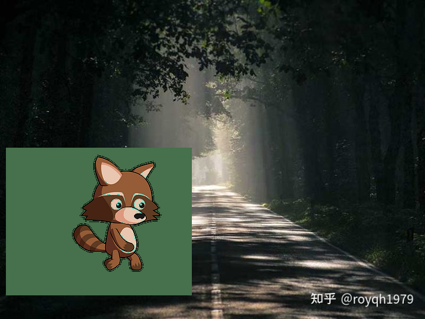
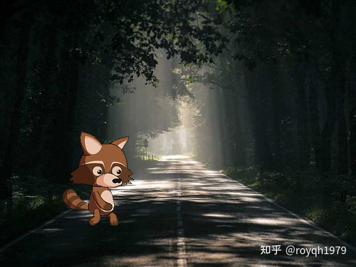

# 2D 贴图: 图层堆叠

ChrisZZ, 2023.01.29

## 1. 贴图的两种实现方式
在实现 imshow() 类似功能时， 有两种思路：

1. 一种方式是把要显示的内容都准备在 Image 中。Image 是存放在内存中的。

2. 另一种是准备 Image 并转为 Texture， 本身然后把需要绘制的矩形、贴图等在 Texture 上绘制。Texture 是显存上的， 相当于说绘制动作是直接往显卡操作的。

在使用 Raylib 时， 可以使用 `DrawTexture()` 和 `DrawTextureRec()` 来完成 texture 的绘制， 是直接操作 texture， 即思路2.

对于思路1， 可以使用 OpenCV 等图像库， 直接在 Image 对象上操作， 相对来说更直接更容易理解原理。

无论是在 Image 层面操作， 还是在 Texture 层面操作， 共同点都是： 在第一个图层基础上， 绘制一个新的图层。 只不过通常第二个图层大小要小于等于第一个图层。

## 2. 在 Image 上实现贴图

### 错误的方法
naive 的思路是， 把小浣熊图片中处于边缘的白色区域都过滤掉， 不是白色的像素则贴到背景的森林图片上。
存在的问题是， 小浣熊本身可能也有白色像素， 导致结果 “花掉”。
```c++
// 在背景图上绘制小浣熊
void image_mapping_2d_bad()
{
    std::string bg_img_path = "forest.jpg";
    std::string racoon_img_path = "racoon.png";

    cv::Mat bg = cv::imread(bg_img_path);
    cv::Mat racoon = cv::imread(racoon_img_path, cv::IMREAD_UNCHANGED); // to load 4 channels
    printf("racoon.channel = %d\n", racoon.channels());

    cv::Point p(10, 250);
    for (int i = 0; i < racoon.rows; i++)
    {
        for (int j = 0; j < racoon.cols; j++)
        {
            int bi = p.y + i;
            int bj = p.x + j;
            for (int k = 0; k < 3; k++)
            {
                if (racoon.ptr(i, j)[k] != 255)
                {
                    bg.ptr(bi, bj)[k] = racoon.ptr(i, j)[k];
                }
            }
        }
    }

    cv::imshow("result", bg);
    cv::waitKey(0);
    cv::imwrite("result-bad.png", bg);
}
```



### 正确的方法： 根据小浣熊图像的 alpha 通道来贴图

```c++
// 在背景图上绘制小浣熊
void image_mapping_2d_good()
{
    std::string bg_img_path = "forest.jpg";
    std::string racoon_img_path = "racoon.png";

    cv::Mat bg = cv::imread(bg_img_path);
    cv::Mat racoon = cv::imread(racoon_img_path, cv::IMREAD_UNCHANGED); // to load 4 channels
    printf("racoon.channel = %d\n", racoon.channels());

    cv::Point p(10, 250);
    for (int i = 0; i < racoon.rows; i++)
    {
        for (int j = 0; j < racoon.cols; j++)
        {
            int bi = p.y + i;
            int bj = p.x + j;
            // Alpha 通道是透明度。值越大，就越不透明；范围是 0~255，即 255 是不透明，0是全透明。
            // 当小浣熊图像里的像素不透明时， 把像素贴到背景（森林大道）图上
            if (racoon.ptr(i, j)[3] == 255)
            {
                for (int k = 0; k < 3; k++)
                {
                    bg.ptr(bi, bj)[k] = racoon.ptr(i, j)[k];
                }
            }
        }
    }

    cv::imshow("result", bg);
    cv::waitKey(0);
    cv::imwrite("result-good.png", bg);
}
```



## 参考
https://zhuanlan.zhihu.com/p/536015371