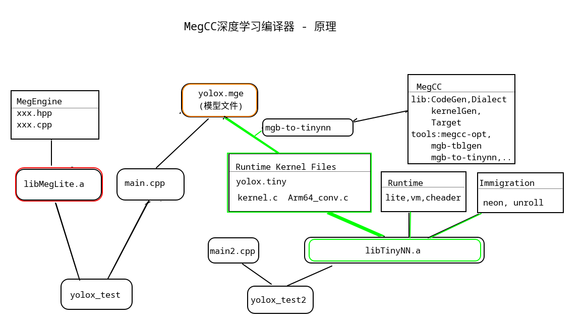

# MegCC 解读

2022-12-05 16:21:21

MegCC (https://github.com/MegEngine/MegCC) 是一个深度学习编译器。

## 1. 原理
按个人理解绘制如下：



上图左边 yolox_test 是传统的深度学习推理部署方案， 是把训练好的模型文件 yolox.mge 直接传给推理引擎 MegLite 的加载模型的接口（main.cpp 作为调用 MegLite 的载体）。

右图则是 MegCC 的方案， 是把训练好的模型文件 yolox.mge 转换为 Runtime Kernel 文件（包括了 yolox.tiny, 以及若干.c文件）， 然后 Runtime Kernel 文件协同 Runtime 目录、 Immigration 目录的源代码， 共同编译出 libTinyNN.a 库文件， 然后再和 main2.cpp 执行编译链接生成可执行文件 yolox_test2。

也就是说， 原来是在程序运行阶段（的一开始）让推理引擎加载模型， 现在则是在编译阶段把模型“吃掉”， 得到必要的推理代码（或者说去掉了不必要的推理代码）放在了 Runtime Kernel Files 目录中（我暂且粗浅的理解为等效于代码剪裁）， 然后和其他必要的公共的代码， 一起编译出 libTinyNN.a 。 换言之现在的推理代码 main2.cpp 不再需要传入模型文件， 但是需要的推理库已经是和模型文件做了“融合消化”。

## 2. 试用
官方给了 yolox 在 android arm64 上运行的例子程序。我操作后整理如下：


### 1. 准备
#### 下载 MegCC 预编译包
从 https://github.com/MegEngine/MegCC 下载， 放到 `~/soft/megcc` 目录。 方便起见， 添加了 `~/soft/megcc/bin` 到 PATH。

#### 下载 OpenCV Android 预编译包
```bash
cd ~/soft/megcc/yolox_example
wget https://github.com/opencv/opencv/releases/download/4.6.0/opencv-4.6.0-android-sdk.zip
unzip opencv-4.6.0-android-sdk.zip 
mv OpenCV-android-sdk OpenCV 
```

#### 设置 安卓 NDK 环境变量
```bash
export ANDROID_NDK=/home/zz/soft/android-ndk-r21e
export NDK_ROOT=$ANDROID_NDK
```

#### 获取 YoloX 的 MegEngine 模型
```bash
# 进入 megcc 安装的根目录
cd ~/soft/megcc/yolox_example

# 获取预训练模型
wget https://github.com/Megvii-BaseDetection/storage/releases/download/0.0.1/yolox_s.mge
```

### 2. 转换 MegEngine 格式的 YoloX 模型为 MegCC 格式的模型

#### build MegCC yolox kernel and MegCC lib for arm 
```bash
mkdir -p kernel_yolox_s_arm # 这个目录是 yolox_arm.json 里指定的， 但是需要手动创建
mgb-to-tinynn --json="./yolox_arm.json" --arm64v7
```

#### convert MegEngine model into MegCC model
见 convert_model.sh

### 3. 编译出可执行程序
见 build_example_test.sh

### 4. 在手机上运行
见 run_on_device.sh

#### 结果展示
原图：


检测结果：


### 5. 可执行文件大小？
```bash
# 96k
du -sh kernel_yolox_s_arm/runtime/install/bin/tinynn_test_lite
```
但这个文件运行的结果， 似乎并不是预期输出， 而且运行要大概1分钟， 不清楚执行了什么操作。。

tinynn_test_lite 依赖了 libTinyNN.a . 而 libTinyNN.a 只有 1.4M 大小。
tinynn_test_lite 只依赖 libTinyNN.a 的很小一部分， 因此只有96K。
要想可执行程序足够小（依赖库是静态库）， 就需要依赖库更小（准确说是被依赖的.o文件加起来的大小更小， 于是可以尽可能拆分为更多的.o文件。）

### 6. 推理速度
按官方回复说例子中用的是 yolox 大模型， 我在xiaomi11上执行速度大约不到600ms：
```
build_arm64/install/bin/yolox_test: 1 file pushed, 0 skipped. 200.9 MB/s (4556688 bytes in 0.022s)
dog.jpg: 1 file pushed, 0 skipped. 106.7 MB/s (163759 bytes in 0.001s)
kernel_yolox_s_arm/yolox_s.tiny: 1 file pushed, 0 skipped. 41.7 MB/s (36007184 bytes in 0.824s)
1 = 0.92085 at 109.87 124.95 473.38 x 337.73
16 = 0.86038 at 130.45 202.16 190.11 x 345.95
7 = 0.62931 at 467.53 74.00 228.78 x 96.66
every iter use time: 574.460999ms
save output to my_out.jpg
```
