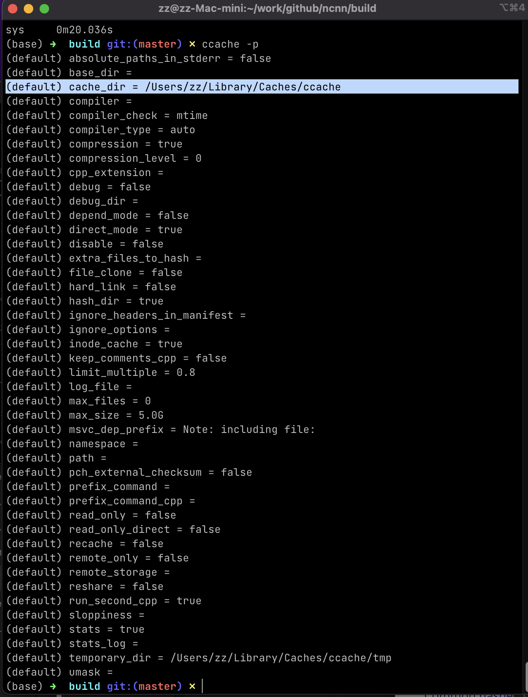
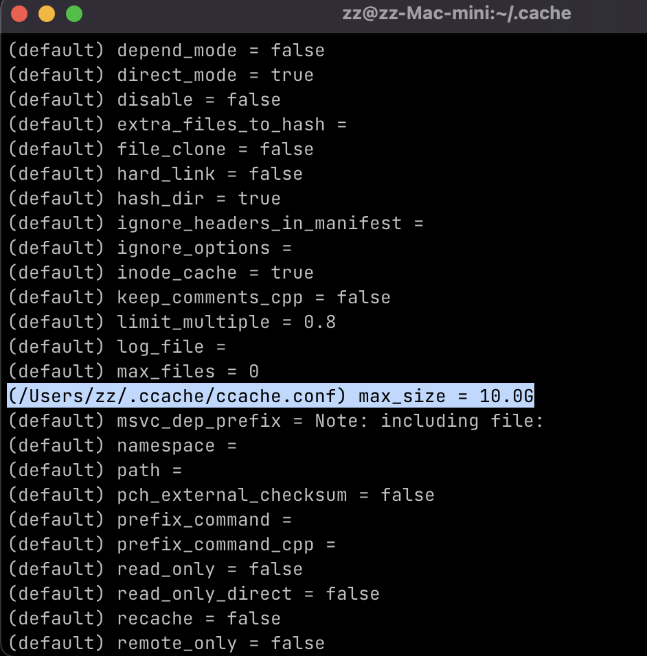

# 使用 Ccache 加速编译

## 1. 目的
编译 LLVM (clang 和 mlir) 时感觉特别慢， 天南星提示说用 ninja+clang+lld+ccache 可以加快编译速度。其中 ccache 我从来没用过， 这里简单记录。

## 2. Ccache 原理和适用情况

Ccache 是 compiler cache 的简称， 是把每个 C/C++ 代码文件经过预处理后的内容执行 md5 计算， 然后在它维护的 cache tree 里中进行查找， 假设没找到则存储一个文件， 文件名字是 md5 的结果， 文件内容则是编译出的 object 文件内容； 而假设之前编译过现在找到了缓存文件， 则直接拿过来用， 也就是空间换时间的思想。

这个缓存有好有坏：
- 成本： 单个文件执行 md5 计算有轻微开销
- 坏处： 如果编译的代码（的预处理结果）一直在变化， 那 md5 计算的开销很明显， 编译反而变慢， 无法受益
- 好处： 如果编译的代码大部分不变（可以是同个工程， 也可以是跨工程）， 那么单个文件的第 >=2 次编译将加速， 编译的次数越多平均速度越快

## 3. 基本使用
需要安装 ccache 命令行工具：
```bash
brew install ccache
```

可以让 ccache 接管编译器， 以后调用 gcc/g++ 时默认调用 ccache； 不过由于我的机器上有多个编译器不方便这样设置， 更合适的方式是在 CMake 中使用：cmake >=3.4， 传入 **`-DCMAKE_CXX_COMPILER_LAUNCHER=ccache`**。

## 4. 性能评测: ncnn
以 [ncnn](https://github.com/tencent/ncnn) 在 apple m1 的编译任务进行实验。

使用到的 ncnn 版本是：
```
* 03550ba5 2022-11-28 | Update release-python.yml (HEAD -> master, upstream/master, upstream/HEAD) [nihui]
```

所有编译实验都使用的 cmake 选项：
- `-DNCNN_BUILD_EXAMPLES=OFF`
- `-DNCNN_PYTHON=OFF`
- `-DNCNN_VULKAN=OFF`
- `-DNCNN_OPENMP=OFF`

完整脚本:
```shell
ARTIFACTS_DIR=$HOME/artifacts
BUILD_DIR=mac-arm64

cmake \
    -S .. \
    -B $BUILD_DIR \
    -G Ninja \
    -DCMAKE_CXX_COMPILER_LAUNCHER=ccache \
    -DCMAKE_BUILD_TYPE=Release \
    -DNCNN_BUILD_EXAMPLES=ON \
    -DNCNN_PYTHON=OFF \
    -DNCNN_VULKAN=OFF \
    -DNCNN_OPENMP=OFF

time cmake --build $BUILD_DIR -j
```

评测结果：

| id  | method           | time cost |
| --- | ---------------- | --------- |
| 1   | make -j          | 28.913 s  |
| 2   | ninja            | 23.639 s  |
| 3   | make -j + ccache | 1.349 s   |
| 4   | ninja + ccache   | **0.840 s**  |

## 5. 性能评测： clang+mlir
real	0m6.316s
user	0m20.099s
sys	0m11.635s

real	4m8.349s
user	18m3.038s
sys	6m33.250s


real	10m26.367s
user	72m15.667s
sys	4m18.866s

real	4m51.021s
user	22m54.205s
sys	6m59.011s

11:25~
real	0m34.468s
user	1m30.820s
sys	0m33.717s

real	4m54.159s
user	22m42.975s
sys	6m56.976s

## 6. ccache 配置

### 打印 cache 的配置
```
ccache -p
```

```
-p, --show-config

    Print current configuration options and from where they originate (environment variable, configuration file or compile-time default) in human-readable format.
```

ccache 在 Mac M1 上的默认缓存目录是 `/Users/zz/Library/Caches/ccache`, 最大缓存 5G. 如果删除了缓存目录， 则执行 ncnn 的编译速度回落到不用 ccache 时的时间范围。



### 修改默认配置
新建 `~/.ccache/ccache.conf` 文件， 添加：
```
max_size = 10.0G
```

执行 `ccache -p` 后可以看到生效了：



## References
- https://wiki.archlinux.org/title/Ccache_(%E7%AE%80%E4%BD%93%E4%B8%AD%E6%96%87)
- https://flameeyes.blog/2008/06/21/debunking-ccache-myths/
- https://ccache.dev/manual/4.7.4.html