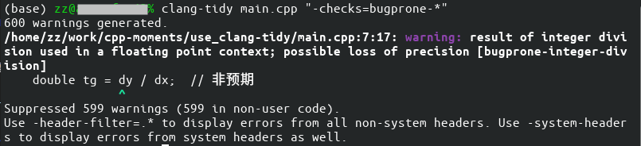
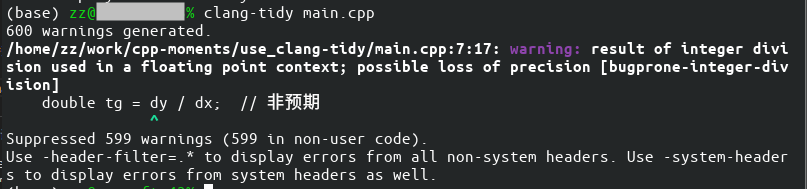
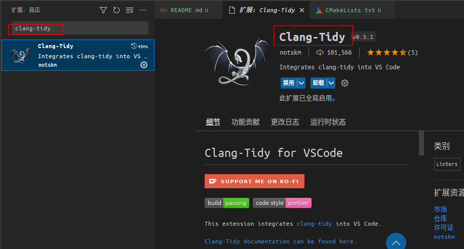
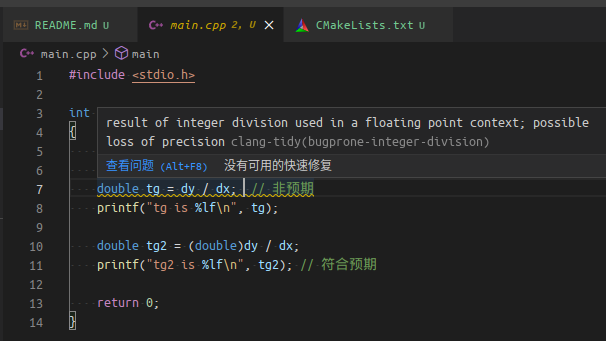
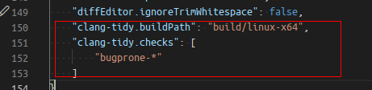
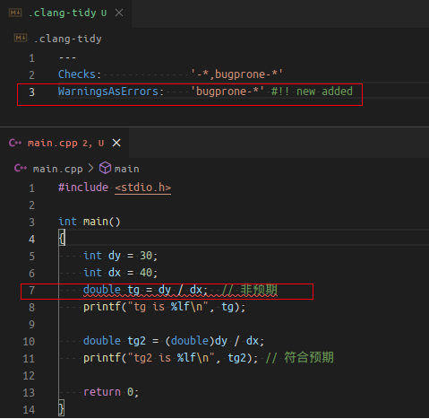

# 使用 clang-tidy

## 1. 目的
在写 C/C++ 代码时排查 bug 花费挺长时间， 发现是两个整数做除法时忘记先转为浮点数导致最终结果不正确， 经过大佬指点可以用 clang-tidy 检查。下面记录对 clang-tidy 的基本使用的相关步骤和命令。

## 2. 准备

### 流程
需要先安装 clang-tidy， 并为需要检查的 cpp 代码所在工程生成编译数据库文件 compile_commands.json， 然后再使用 clang-tidy 执行代码检查。 执行代码检查时可以使用手动传入的参数来定制检查的选项， 也可以使用配置文件。

### 安装
```bash
sudo apt install clang-tidy
```

### 生成编译数据库文件 compile_commands.json
per project 的设置： 在 CMakeLists.txt 里：
```cmake
set(CMAKE_EXPORT_COMPILE_COMMANDS ON)
```

global 的设置: (`~/.bashrc`, `~/.zshrc`)
```bash
export CMAKE_EXPORT_COMPILE_COMMANDS=1
```

然后在 cmake 的 configure 步骤后， 会生成 compile_commands.json 文件。

### 测试代码
使用的 C++ 代码如下：
```c++
#include <stdio.h>

int main()
{
    int dy = 30;
    int dx = 40;
    double tg = dy / dx;  // 非预期
    printf("tg is %lf\n", tg);

    double tg2 = (double)dy / dx;
    printf("tg2 is %lf\n", tg2); // 符合预期

    return 0;
}
```

## 3. 在命令行中使用 clang-tidy

### 最简单的使用
使用 clang-tidy 执行检查：
```bash
# clang-tidy 依赖 compile_commands.json 文件， 把先前生成的拷贝到当前目录
cp build/linux-x64/compile_commands.json ./

# 直接对单个文件执行 clang-tidy 检查， 不带额外参数
clang-tidy main.cpp # 取决于代码和默认开启的check，可能显示为空

# 手动指定一个规则
clang-tidy main.cpp "-checks=bugprone-*"
```

手动指定规则后可以看到输出， 检查到了整数除法赋值给 double 变量的潜在 bug:



### 添加规则到 .clang-tidy 配置文件
在当前目录下创建 `.clang-tidy` 文件， 填入内容：
```yaml
---
Checks:              '-*,bugprone-*'
```

然后用不带参数的方式执行, 可以看到可以检查到除法的潜在bug，和先前手动指定check的方式输出相同：
```bash
clang-tidy main.cpp
```



### 指定 compile_commands.json 路径
使用 `-p` 参数指定 compile_commands.json 所在的目录
```bash
clang-tidy main.cpp -p build/linux-x64
```

## 4. 在 VSCode 中使用 clang-tidy
### 安装 clang-tidy 插件


切回到 .cpp 文件， 确实显示黄色下滑波浪线了， 鼠标放上去可以看到具体的报错提示：


### VSCode 全局配置
前面提到的 `.clang-tidy` 是给单个工程配置的， 是放在工程根目录下的一个文件。也可以在 VSCode 的全局配置文件 setting.json 中配置 clang-tidy：



## 5. clang-tidy 的定制使用
这里以 `.clang-tidy` 的写法作为展示规则的形式。

### 将特定规则检测到的 warning 视作 error
```yaml
---
Checks:              '-*,bugprone-*'
WarningsAsErrors:    'bugprone-*' # !! 这条为新增
```



除了上述 `bugprone-*` 系列的检查规则， 还有很多规则可以使用:
- `abseil-*` 系列
- `clang-analyzer-*` 系列
- `cppcoreguidelines-*` 系列
- `google-*` 系列
- `hicpp-*` 系列
- `modernize-*` 系列
- `readability-*` 系列

完整的 check 规则见： [https://clang.llvm.org/extra/clang-tidy/checks/list.html](https://clang.llvm.org/extra/clang-tidy/checks/list.html)

