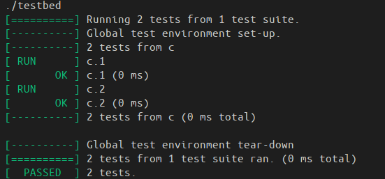
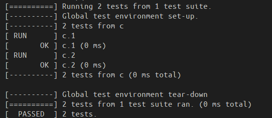
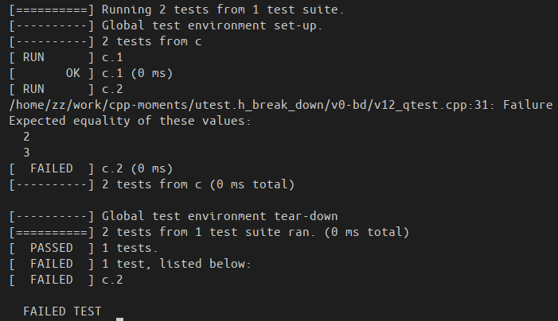
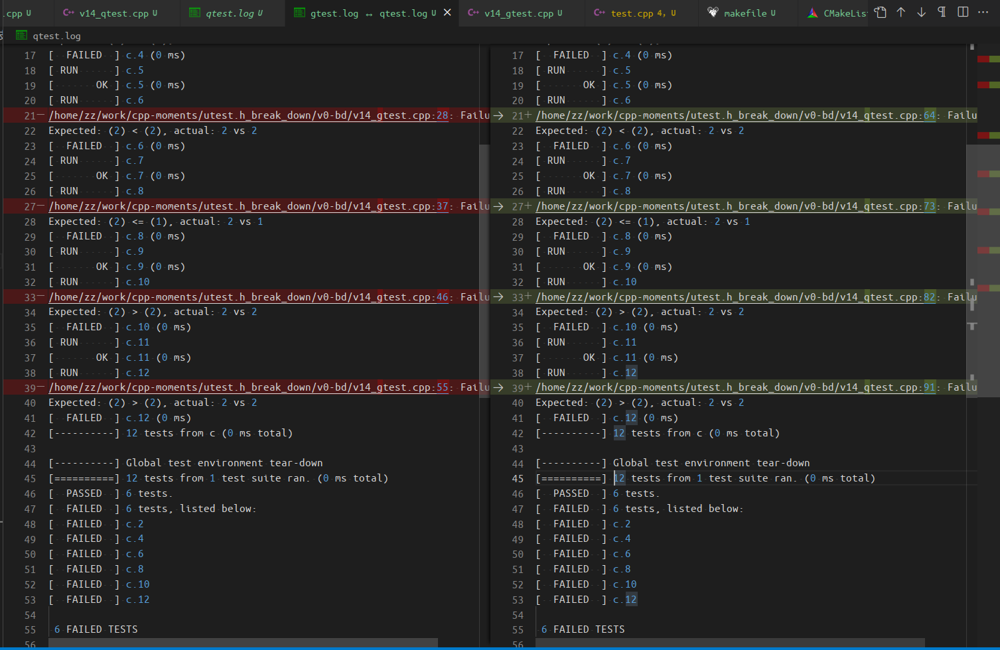
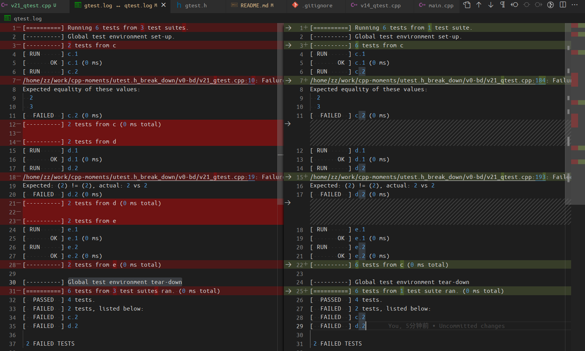
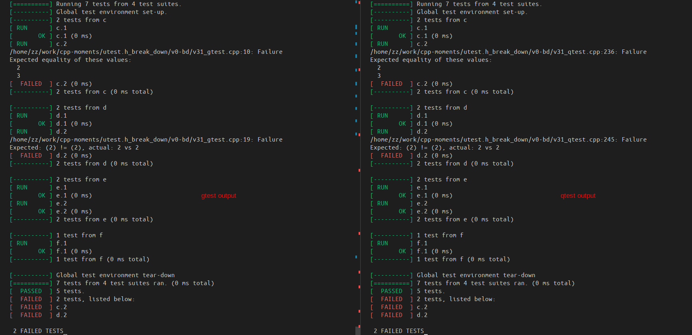

# qtest: 一个单元测试库的从头实现

## 0. 目的
用 C++ 实现一个单元测试库：
- 提供 EXPECT_EQ, ASSERT_EQ 等断言， 和 GTest 一致
- 运行输出绿色（success)、红色（fail），和 GTest 一致
- 代码在400行以内， 可以使用 C++11， 参考了 utest.h 第一个 commit

文本接下来使用 “client” 表示调用侧的代码， 使用 “dev” 表示测试框架的开发端的代码。

最终版本是 qtest_v51.cpp , 你可以把它改名为 qtest.hpp, 以 header-only 的形式使用。

## 1. 断言的实现
打算实现的断言如下， 其中 `EXPECT_*` 系列不会导致程序终止， 仅输出 Failure 和文件、行号信息。`ASSERT_*` 系列则在输出报错信息的基础上， 让当前测试用例函数停止运行。

| EXPECT_* 系列    | ASSERT_* 系列   |
| ---------------- | --------------- |
| EXPECT_EQ(x, y)  | ASSERT_EQ(x, y) |
| EXPECT_NE(x, y)  | ASSERT_NE(x, y) |
| EXPECT_LT(x, y)  | ASSERT_LT(x, y) |
| EXPECT_LE(x, y)  | ASSERT_LE(x, y) |
| EXPECT_GT(x, y)  | ASSERT_GT(x, y) |
| EXPECT_GE(x, y)  | ASSERT_GE(x, y) |
| EXPECT_TRUE(x)   | ASSERT_TRUE(x)  |
| EXPECT_FALSE(x)  | ASSERT_FALSE(x) |

### 1.1 从最简单断言的输出开始复刻
v11_gtest.cpp 是最简单的断言的使用， 包括了两个测试用例， 每个测试用例仅使用 `EXPECT_EQ` 做检查， 并且检查结果是成功的。

运行结果如下：


在 v11_qtest.cpp 中复刻了 gtest 的测试用例和输出内容； 简单起见没有增加颜色, 并且大量的硬编码； `EXPECT_EQ` 定义为空的实现。输出如下：


### 1.2 正确的实现 `EXPECT_EQ()`
v12_gtest.cpp 在 v11_gtest.cpp 基础上， 把success的测试用例改为了fail:
```c++
TEST(c, 1)
{
    EXPECT_EQ(1, 1);
}

TEST(c, 2)
{
    EXPECT_EQ(2, 3); // 这里会fail
}
```
输出如下：


在 v12_qtest.cpp 中修改 `EXPECT_TRUE` 为如下：
```c++
#define EXPECT_EQ(x, y) \
    if ((x)!=(y)) \
    { \
        printf("%s:%u: Failure\n", __FILE__, __LINE__); \
        printf("Expected equality of these values:\n"); \
        printf("  %s\n  %s\n", #x, #y); \
    }
```

这样能够对于 failed 的case输出信息了。但是， gtest 还有统计信息， 包括同个 test set 内的统计， 以及所有 test set 的统计。当前我们的测试用例只有一个 set。通过对于每个测试用例函数维护一个 state， 分别记录测试用例的名称， 以及是否执行成功； 然后在执行测试用例的过程中， 如果 `EXPECT_EQ` 失败， 则标记当前用例的状态为 false。因此修改为如下定义：
```c++

bool qtest_success = true;
int qtest_total_cnt = 0;
int qtest_fail_cnt = 0;

#define EXPECT_EQ(x, y) \
    if ((x)!=(y)) \
    { \
        printf("%s:%u: Failure\n", __FILE__, __LINE__); \
        printf("Expected equality of these values:\n"); \
        printf("  %s\n  %s\n", #x, #y); \
        qtest_success = false; \
    } \
    else \
    { \
        qtest_success = true; \
    }
```

并在 `RUN_ALL_TESTS()` 中的每个测试用例执行前后， 维护它的状态：
```c++
int RUN_ALL_TESTS()
{
    qtest_state_t qtest_state[2]; // 暂且硬编码

    // testcase1
    qtest_state[qtest_total_cnt].name = "c.1";
    printf("[ RUN      ] %s\n", qtest_state[qtest_total_cnt].name);
    qtest_c_1();
    if (qtest_success)
    {
        printf("[       OK ] %s (0 ms)\n", qtest_state[qtest_total_cnt].name);
    }
    else
    {
        printf("[  FAILED  ] %s (0 ms)\n", qtest_state[qtest_total_cnt].name);
        qtest_fail_cnt++;
    }
    qtest_state[qtest_total_cnt].state = qtest_success;
    qtest_total_cnt++;

    ...
}
```

输出如下：


### v1.3 支持 `EXPECT_NE()`
仿照 `EXPECT_EQ()` 即可。略。

### v1.4 支持更多的 `EXPECT_*` 断言
仿照 `EXPECT_EQ()` 可以实现 `EXPECT_LT()`, 但这样导致和 `EXPECT_NE()` 的代码基本一样， 这三个宏的代码考虑重构, 实现如下：
```c++
#define QTEST_EXPECT(x, y, cond) \
    if (!((x)cond(y))) \
    { \
        printf("%s:%u: Failure\n", __FILE__, __LINE__); \
        if (strcmp(#cond, "==") == 0) \
        { \
            printf("Expected equality of these values:\n"); \
            printf("  %s\n  %s\n", #x, #y); \
        } \
        else \
        { \
            printf("Expected: (%s) %s (%s), actual: %s vs %s\n", #x, #cond, #y, #x, #y); \
        } \
        qtest_success = false; \
    } \
    else \
    { \
        qtest_success = true; \
    }

#define EXPECT_EQ(x, y) QTEST_EXPECT(x, y, ==)
#define EXPECT_NE(x, y) QTEST_EXPECT(x, y, !=)
#define EXPECT_LT(x, y) QTEST_EXPECT(x, y, <)

// 顺带把其他几个 binary 断言也都实现了：
#define EXPECT_LE(x, y) QTEST_EXPECT(x, y, <=)
#define EXPECT_GT(x, y) QTEST_EXPECT(x, y, >)
#define EXPECT_GE(x, y) QTEST_EXPECT(x, y, >=)
```

同时， 在 `RUN_ALL_TESTS()` 中执行每个单元测试函数并统计状态信息时， 之前一直是手动处理每个case， 现在也考虑重构， 方法是定义一个宏来完成代码复用：

```c++
#define RUN_SINGLE_TEST(test_set, test_name) \
    { \
        qtest_state[qtest_total_cnt].name = #test_set "." #test_name; \
        printf("[ RUN      ] %s\n", qtest_state[qtest_total_cnt].name); \
        qtest_##test_set##_##test_name(); \
        if (qtest_success) \
        { \
            printf("[       OK ] %s (0 ms)\n", qtest_state[qtest_total_cnt].name); \
        } \
        else \
        { \
            printf("[  FAILED  ] %s (0 ms)\n", qtest_state[qtest_total_cnt].name); \
            qtest_fail_cnt++; \
        } \
        qtest_state[qtest_total_cnt].state = qtest_success; \
        qtest_total_cnt++; \
    }

    // testcase1
    RUN_SINGLE_TEST(c, 1);
    RUN_SINGLE_TEST(c, 2);
    RUN_SINGLE_TEST(c, 3);
    RUN_SINGLE_TEST(c, 4);
    RUN_SINGLE_TEST(c, 5);
    RUN_SINGLE_TEST(c, 6);
    RUN_SINGLE_TEST(c, 7);
    RUN_SINGLE_TEST(c, 8);
    RUN_SINGLE_TEST(c, 9);
    RUN_SINGLE_TEST(c, 10);
    RUN_SINGLE_TEST(c, 11);
    RUN_SINGLE_TEST(c, 12);
```

对比 gtest 和 qtest 的输出， 在当前测试用例下， 只有代码行号的差别：


### 1.5 EXPECT_TRUE, EXPECT_FALSE 的实现
比较 trivial, 实现如下, 运行效果和 gtest 一样
```c++
#define EXPECT_TRUE(x) \
    if (!((x))) \
    { \
        printf("%s:%u: Failure\n", __FILE__, __LINE__); \
        printf("Value of: %s\n", #x); \
        printf("  Actual: false\n"); \
        printf("Expected: true\n"); \
        qtest_success = false; \
    } \
    else \
    { \
        qtest_success = true; \
    }

#define EXPECT_FALSE(x) \
    if (((x))) \
    { \
        printf("%s:%u: Failure\n", __FILE__, __LINE__); \
        printf("Value of: %s\n", #x); \
        printf("  Actual: true\n"); \
        printf("Expected: false\n"); \
        qtest_success = false; \
    } \
    else \
    { \
        qtest_success = true; \
    }
```

### 1.6 实现 ASSERT_EQ()
`ASSERT_*` 相比于 `EXPECT_*` 系列， 区别在于一旦条件失败就结束当前函数， 而不是继续运行。 因此直接使用 return 可以（初步）达到目的， 实现如下：
```c++
#define ASSERT_EQ(x, y) \
    if ((x)!=(y)) \
    { \
        printf("%s:%u: Failure\n", __FILE__, __LINE__); \
        printf("Expected equality of these values:\n"); \
        printf("  %s\n", #x); \
        printf("  %s\n", #y); \
        qtest_current_fail_cnt++; \
        return; \
    }
```

`ASSERT_*` 系列断言的提前返回， 因此单元测试函数是否执行成功的逻辑考虑更新（顺带发现了之前的实现逻辑有bug）， 新的逻辑是 “统计单元测试函数中失败的断言数量， 大于0就表示失败， 等于0表示成功”。
```c++
int qtest_current_fail_cnt = 0; // number of failures in one test function
...
#define RUN_SINGLE_TEST(test_set, test_name) \
    { \
        qtest_state[qtest_total_cnt].name = #test_set "." #test_name; \
        qtest_current_fail_cnt = 0; \
        printf("[ RUN      ] %s\n", qtest_state[qtest_total_cnt].name); \
        qtest_##test_set##_##test_name(); \
        if (qtest_current_fail_cnt == 0) \
        { \
            printf("[       OK ] %s (0 ms)\n", qtest_state[qtest_total_cnt].name); \
        } \
        else \
        { \
            printf("[  FAILED  ] %s (0 ms)\n", qtest_state[qtest_total_cnt].name); \
            qtest_fail_cnt++; \
        } \
        qtest_state[qtest_total_cnt].state = (qtest_current_fail_cnt == 0); \
        qtest_total_cnt++; \
    }
```

考虑 `ASSERT_EQ(1+2, 2+2);` 这个 case：

对于传入 `ASSERT_EQ(x, y)` 的参数x或y不是单个变量而是表达式时， 例如 `1+2`,  gtest 会把表达式求值之后的结果打印出来（也就是3）。这个特性可以基于模板实现， 思路是把x或y这样的参数的字符串结果（编译期）传给函数， 并且把 x和y这样的表达式本身也传入， 传入的过程中（在运行期）会执行计算， 到了函数里头就是计算完的值了， 再交给 std::to_string() 得到字符串结果， 再和编译期确定的字符串比较， 如果不一样那就要额外打印。代码如下：

```c++
template<typename T>
void qtest_evaluate_if_required(const char* str, T value)
{
    if (strcmp(str, std::to_string(value).c_str()) != 0)
    {
        std::cout << "    Which is: " << value << std::endl;
    }
}

#define ASSERT_EQ(x, y) \
    if ((x)!=(y)) \
    { \
        printf("%s:%u: Failure\n", __FILE__, __LINE__); \
        printf("Expected equality of these values:\n"); \
        printf("  %s\n", #x); \
        qtest_evaluate_if_required(#x, x); \
        printf("  %s\n", #y); \
        qtest_evaluate_if_required(#y, y); \
        qtest_current_fail_cnt++; \
        return; \
    }
```

实际上， 不仅仅是 `ASSERT_EQ()` 需要按需对传入的参数求值， 其他的断言宏也需要这样处理。具体处理见代码 v16_qtest.cpp.

## 2. 自动注册的实现
前一小节专注于断言的实现， 注册每个单元测试函数则是手动完成的， 主要是在 `RUN_ALL_TESTS()` 函数中：
```c++
    RUN_SINGLE_TEST(c, 21);
    RUN_SINGLE_TEST(c, 22);
    RUN_SINGLE_TEST(c, 23);
```
本小节则专注于， 避免在 `RUN_ALL_TESTS()` 中手动指定每个需要测试的函数， 改为自动执行所有的单元测试函数。

### 2.1 自动注册和执行所有单元测试函数
`TEST(set, name)` 的形式， 决定了相同 `set` 的单元格测试函数属于同一个 set。
尝试了最新版 utest.h (2022-12-19), 并不支持单元测试分组分别输出。

在 v21_gtest.cpp 和 v21_qtest.cpp 中， 首先添加了多组测试用例（包括 c, d, e 这三组， 每一组有2个测试函数）。

基于先前实现的 “一个简陋的单元测试框架的实现”， 使用 Singleton 模式实现了自动注册和运行所有单元测试函数。 不过现在并没有按 set 分组， 而是直接全量执行和输出。



### 2.2 用 map 实现测试用例分组
不用 unordered_map 的原因是， 在遍历 unordered_map 时无法保证和 insert 时的顺序是一样的。

此外还创建了 `TestEntity:;make_proper_str()` 函数用于正确的生成字符串的单数和负数形式。

## 3. 添加颜色
```c++
#define QTEST_ESCAPE_COLOR_RED "\x1b[31m"
#define QTEST_ESCAPE_COLOR_GREEN "\x1b[32m"
#define QTEST_ESCAPE_COLOR_YELLOW "\x1b[33m"
#define QTEST_ESCAPE_COLOR_END "\x1b[0m"
```
使用如上4个表示颜色的宏即可实现红色绿色的打印。

打印效果和 gtest 原版一样：


## 4. 支持带通配符（wildcard）的过滤条件

GoogleTest 里对于过滤的说明文档： https://github.com/google/googletest/blob/main/docs/advanced.md#running-a-subset-of-the-tests

### 4.1 支持正向的过滤
```c++
int main()
{
    InitQTest();
    QTEST_FILTER("c*.1");
    return RUN_ALL_TESTS();
}
```

一开始误以为是正则， 其实是通配符。
参考了 https://www.geeksforgeeks.org/wildcard-pattern-matching/ 进行了实现


## 5. 消除全局变量
参照了 utest.h 第一个 commit 中的写法:
```c++
#define UTEST_ASSERT(x, y, cond)                                               \
  if (!((x)cond(y))) {                                                         \
    printf("%s:%u: Failure\n", __FILE__, __LINE__);                            \
    *utest_result = 1;                                                         \
    return;                                                                    \
  }
```
其中 `*utest_result = 1` 使用到了指针类型的变量， 是在 `TESTCASE` 宏定义的时候声明和定义的单元测试函数传参穿进去的：
```c++
#define TESTCASE(set, name)                                                    \
  extern struct utest_state_s utest_state;                                     \
  static void utest_run_##set##_##name(int *utest_result);                     \
  UTEST_INITIALIZER(utest_register_##set##_##name) {                           \
    const size_t index = utest_state.testcases_length++;                       \
    utest_state.testcases = UTEST_PTR_CAST(                                    \
        utest_testcase_t *,                                                    \
        realloc(utest_state.testcases,                                         \
                sizeof(utest_testcase_t) * utest_state.testcases_length));     \
    utest_state.testcases[index] = &utest_run_##set##_##name;                  \
    utest_state.testcase_names = UTEST_PTR_CAST(                               \
        const char **,                                                         \
        realloc(utest_state.testcase_names,                                    \
                sizeof(char *) * utest_state.testcases_length));               \
    utest_state.testcase_names[index] = #set "." #name;                        \
  }                                                                            \
  void utest_run_##set##_##name(int *utest_result)
```
因此把先前 v41_qtest.cpp 里的全局变量改为作为单元测试函数 `f()` 的参数传入即可。


## 5. Limitations
- 统计单元测试函数运行耗时， 目前硬编码为 0ms， 需要修复
- 测试套件 （Fixture） 的实现（平时用的不多， 可能实现有难度）
- 不支持两个 vector 的比较
    - 是由 `qtest_evaluate_if_required()` 的实现导致的