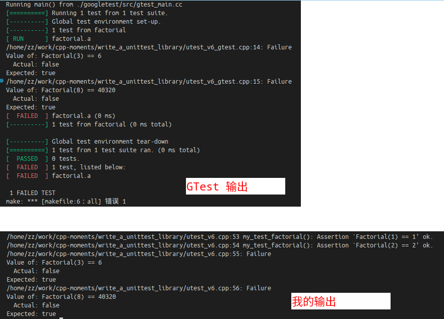
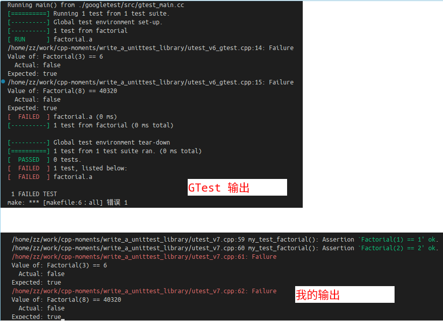

# MY_TEST: 从头实现一个简陋的、基于C++的单元测试框架

[TOC]

## 0. 目的
对于 C/C++ 不熟悉， 对于单元测试也不熟悉， 练习一下。下面使用 client 和 dev， 分别表示单元测试库的使用者、开发者角色视角。开发环境是 ubuntu 22.04 搭配 Clang-16.

## 1. printf 方法
client 侧代码：
```c++
int main()
{
    int p = 4;
    MY_ASSERT(p == 3);
}
```

dev 侧代码：
```c++
#define MY_ASSERT(expr)   \
    if (expr) \
    { \
        printf("Success\n"); \
    } \
    else \
    { \
        printf("Failed\n"); \
    }
```

定义 `MY_ASSERT` 的好处是， 简单直接， 在 Debug 和 Release 下表现一致。相比于 `assert` 宏， 少了行号和表达式信息， 这是缺点。

## 2. assert 方法
client 的写法：
```c++
#include <stdio.h>
#include <assert.h>

int main()
{
    int p = 4;
    assert(p == 3);
    return 0;
}
```

在 Debug 模式下会检查到表达式为 false， 因此报告错误， 符合预期：
```
testbed: /home/zz/work/cpp-moments/write_a_unittest_library/utest_v2.cpp:7: int main(): Assertion `p == 3' failed.
zsh: IOT instruction (core dumped)  ./testbed
```

而在 Release 模式下(准确说是 NDEBUG 宏有定义的时候) `assert` 宏定义有所不同， 相当于什么都不做， 因此不会报告错误:

```c++
#ifdef	NDEBUG

# define assert(expr)		(__ASSERT_VOID_CAST (0))
```

```c++
#if defined __cplusplus && __GNUC_PREREQ (2,95)
# define __ASSERT_VOID_CAST static_cast<void>
#else
# define __ASSERT_VOID_CAST (void)
#endif
```

## 3. 基于 assert 在 Debug 模式下的定义进行改造

在 Debug 模式下 `assert` 宏的定义为：
```c++
/* When possible, define assert so that it does not add extra
   parentheses around EXPR.  Otherwise, those added parentheses would
   suppress warnings we'd expect to be detected by gcc's -Wparentheses.  */
# if defined __cplusplus
#  define assert(expr)							\
     (static_cast <bool> (expr)						\
      ? void (0)							\
      : __assert_fail (#expr, __FILE__, __LINE__, __ASSERT_FUNCTION))
# elif !defined __GNUC__ || defined __STRICT_ANSI__
#  define assert(expr)							\
    ((expr)								\
     ? __ASSERT_VOID_CAST (0)						\
     : __assert_fail (#expr, __FILE__, __LINE__, __ASSERT_FUNCTION))
# else
/* The first occurrence of EXPR is not evaluated due to the sizeof,
   but will trigger any pedantic warnings masked by the __extension__
   for the second occurrence.  The ternary operator is required to
   support function pointers and bit fields in this context, and to
   suppress the evaluation of variable length arrays.  */
#  define assert(expr)							\
  ((void) sizeof ((expr) ? 1 : 0), __extension__ ({			\
      if (expr)								\
        ; /* empty */							\
      else								\
        __assert_fail (#expr, __FILE__, __LINE__, __ASSERT_FUNCTION);	\
    }))
# endif
```

其中 `__assert_fail` 的声明如下：
```c++
/* This prints an "Assertion failed" message and aborts.  */
extern void __assert_fail (const char *__assertion, const char *__file,
			   unsigned int __line, const char *__function)
     __THROW __attribute__ ((__noreturn__));
```

于是可以把 debug 模式下 `assert` 宏的定义拷贝出来， 自行定义为 `MY_ASSERT`, 使得它在 debug 和 release 模式下都能用， 并且替换 `__assert_fail` 为自行定义的 log 库的输出语句。这里简单起见只考虑 C++ 的情况：
```c++
#if __ANDROID_API__ >= 8
#include <android/log.h>
#define MY_LOGE(...)                                                \
    do {                                                               \
        fprintf(stderr, ##__VA_ARGS__);                                \
        __android_log_print(ANDROID_LOG_WARN, "my", ##__VA_ARGS__); \
    } while (0)
#else
#include <stdio.h>
#define MY_LOGE(...)                 \
    do {                                \
        fprintf(stderr, ##__VA_ARGS__); \
    } while (0)
#endif

void my_assert_fail(const char* assertion, const char* filename, unsigned int linenumber, const char* function)
{
    MY_LOGE("[MY] %s:%d %s(): Assertion `%s' failed.", filename, linenumber, function, assertion);
}

#define MY_ASSERT(expr) \
    (static_cast<bool>(expr)    \
    ? void(0) \
    : my_assert_fail(#expr, __FILE__, __LINE__, __FUNCTION__))


int main()
{
    int p = 4;
    MY_ASSERT(p == 3);
    return 0;
}
```

运行输出：
```
./testbed
/home/zz/work/cpp-moments/write_a_unittest_library/utest_v3.cpp:33 main(): Assertion `p == 3' failed.%  
```
可以看到和原版 `assert` 输出一样。

## 4. 满足条件时也要输出信息
上一步定义的 `MY_ASSERT` 只能处理 expr 为 false 的情况。 如果 expr 为 true， googletest 也是会输出信息的：

client 使用如下代码：
```c++
#include "gtest/gtest.h"

TEST(a, b)
{
    int p = 4;
    ASSERT_TRUE(p == 4);
}
```

输出为：
```
./testbed
Running main() from ./googletest/src/gtest_main.cc
[==========] Running 1 test from 1 test suite.
[----------] Global test environment set-up.
[----------] 1 test from a
[ RUN      ] a.b
[       OK ] a.b (0 ms)
[----------] 1 test from a (0 ms total)

[----------] Global test environment tear-down
[==========] 1 test from 1 test suite ran. (0 ms total)
[  PASSED  ] 1 test.
```

因此将 utest_v3.cpp 中的 `MY_ASSERT` 宏定义修改为如下：
```c++
void my_assert_fail(const char* assertion, const char* filename, unsigned int linenumber, const char* function)
{
    MY_LOGE("%s:%d %s(): Assertion `%s' failed.\n", filename, linenumber, function, assertion);
}

void my_assert_success(const char* assertion, const char* filename, unsigned int linenumber, const char* function)
{
    MY_LOGE("%s:%d %s(): Assertion `%s' ok.\n", filename, linenumber, function, assertion);
}

#define MY_ASSERT(expr) \
    (static_cast<bool>(expr)    \
    ? my_assert_success(#expr, __FILE__, __LINE__, __FUNCTION__) \
    : my_assert_fail(#expr, __FILE__, __LINE__, __FUNCTION__))

```

当 client 调用代码如下：
```c++
int main()
{
    int p = 4;
    MY_ASSERT(p == 3);
    MY_ASSERT(p == 4);
    return 0;
}
```
运行将产生如下输出：
```
/home/zz/work/cpp-moments/write_a_unittest_library/utest_v4.cpp:35 main(): Assertion `p == 3' failed.
/home/zz/work/cpp-moments/write_a_unittest_library/utest_v4.cpp:36 main(): Assertion `p == 4' ok.
```

## 5. 区分 EXPECT 和 ASSERT
在 googletest 中， `EXPECT_*` 系列宏会做检查， 但不会让整个函数停止运行； `ASSERT_*` 系列宏则是一旦检测到 expr 为 false 就让整个函数停止运行, 并且要求当前单元测试函数返回值必须是 void 类型。

在上一部我们实现的 `MY_ASSERT` 其实用 `MY_EXPECT_TRUE` 这个名字更合适， 同时还需要定义 `MY_ASSERT_TRUE` 宏。 dev 端代码如下：
```c++

#define MY_EXPECT_TRUE(expr) \
    (static_cast<bool>(expr)    \
    ? my_assert_success(#expr, __FILE__, __LINE__, __FUNCTION__) \
    : my_assert_fail(#expr, __FILE__, __LINE__, __FUNCTION__))

#define MY_ASSERT_TRUE(expr) \
    (static_cast<bool>(expr)    \
    ? my_assert_success(#expr, __FILE__, __LINE__, __FUNCTION__) \
    : my_assert_fail(#expr, __FILE__, __LINE__, __FUNCTION__)); return;
```
即： 在 `MY_EXPECT_TRUE` 基础上， expr 为 false 时增加调用 `return` 或 `exit(1)`. 使用 `exit(1)` 的话则不要求函数返回值为 void， 使用 `return` 则要求函数返回值为 `void`.

client 侧代码如下：
```c++
void test_sample()
{
    int p = 4;
    MY_EXPECT_TRUE(p == 3);
    MY_EXPECT_TRUE(p == 4);

    MY_ASSERT_TRUE(p == 3);
    MY_ASSERT_TRUE(p == 4);
}

int main()
{
    test_sample();
    return 0;
}
```

运行输出：
```
/home/zz/work/cpp-moments/write_a_unittest_library/utest_v5.cpp:41 test_sample(): Assertion `p == 3' failed.
/home/zz/work/cpp-moments/write_a_unittest_library/utest_v5.cpp:42 test_sample(): Assertion `p == 4' ok.
/home/zz/work/cpp-moments/write_a_unittest_library/utest_v5.cpp:44 test_sample(): Assertion `p == 3' failed.
```

## 6. 注册单元测试函数
截止前一步的实现仍然只是个简陋的 log 库， 这一小节我们实现单元测试的注册机制。

以 googletest 为例， 这样注册：
```c++
// Tests factorial of positive numbers.
TEST(factorial, a)
{
    EXPECT_TRUE(Factorial(1) == 1);
    EXPECT_TRUE(Factorial(2) == 2);
    EXPECT_TRUE(Factorial(3) == 6);
    EXPECT_TRUE(Factorial(8) == 40320);
}
```

`TEST(FactorialTest, a)` 会被转为一个类以及这个类的一个成员函数， 这看起来宏定义会比较不好实现， 我们这次先只考虑注册一个测试函数：
```c++
MY_TEST(factorial)
{
    MY_EXPECT_TRUE(Factorial(1) == 1);
    MY_EXPECT_TRUE(Factorial(2) == 2);
    MY_EXPECT_TRUE(Factorial(3) == 6);
    MY_EXPECT_TRUE(Factorial(8) == 40320);
}
```

需要把 `MY_TEST(factorial)` 转换为一个函数的 header， 简单起见声明为 void 类型， 定义如下：
```c++
#define MY_TEST(name) \
    void my_test_##name()
```

为了和 gtest 的输出看起来差不多， 在 MY_EXPECT_TRUE 失败时应该打印 expr 以及预期的取值（true）:
```c++
void my_assert_fail(const char* assertion, const char* filename, unsigned int linenumber, const char* function)
{
    MY_LOGE("%s:%d: Failure\nValue of: %s\n  Actual: false\nExpected: true\n", filename, linenumber, assertion);
}
```

和 gtest 比较一下运行输出的结果：


可以看到， 虽然没有颜色高亮和 success/fail 统计信息， 但是检查到测试失败时可以输出文件行号和具体的表达式， 并且代码实现也相对简单。

## 7. 失败时红色输出
利用 ASCII 转义字符可以实现带颜色的打印。例如：
```c++
#include <stdio.h>

#define escape_color_blue "\x1b[94m"
#define escape_color_red "\x1b[31m"
#define escape_color_green "\x1b[32m"
#define escape_color_yellow "\x1b[33m"
#define escape_color_purple "\x1b[35m"
#define escape_color_end "\x1b[0m"

#define LOGD(fmt, ...) \
    fprintf(stdout, ("%s[%-5s]\x1b[0m" fmt "\n"), log_colors_debug, "debug", ##__VA_ARGS__)

int main()
{
    //LOGD("%s", "hello");

    fprintf(stdout, ("%sred%s\n"), escape_color_red, escape_color_end);
    fprintf(stdout, ("%sgreen%s\n"), escape_color_red, escape_color_end);

    return 0;
}
```

将测试失败时错误输出处理的函数 `my_assert_fail` 进行改造， 把第一行输出（文件名+行号+failure）用红色显示。
```c++
void my_assert_fail(const char* assertion, const char* filename, unsigned int linenumber, const char* function)
{
    MY_LOGE("%s%s:%d: Failure%s\n", MY_ESCAPE_COLOR_RED, filename, linenumber, MY_ESCAPE_COLOR_END);
    MY_LOGE("Value of: %s\n  Actual: false\nExpected: true\n", assertion);
}
```

其实把失败情况用红色标记已经足够， 不过如果想给自己点信心， 也可以把通过的情况用绿色标出：
```c++
void my_assert_success(const char* assertion, const char* filename, unsigned int linenumber, const char* function)
{
    MY_LOGE("%s:%d %s(): Assertion %s`%s' ok%s.\n", filename, linenumber, function, MY_ESCAPE_COLOR_GREEN, assertion, MY_ESCAPE_COLOR_END);
}
```



## 8. 补齐常用的4个检查宏

| gtest 写法    | 我的写法 |
| ------------- | -------- |
| `EXPECT_TRUE` | `MY_EXPECT_TRUE` |
| `EXPECT_EQ`   | `MY_EXPECT_EQ` |
| `ASSERT_TRUE` |`MY_ASSERT_TRUE` |
| `ASSERT_EQ`   |`MY_ASSERT_EQ` |

dev 关键端代码：
```c++

void my_true_fail(const char* assertion, const char* filename, unsigned int linenumber, const char* function)
{
    MY_LOGE("%s%s:%d: Failure%s\n", MY_ESCAPE_COLOR_RED, filename, linenumber, MY_ESCAPE_COLOR_END);
    MY_LOGE("Value of: %s\n  Actual: false\nExpected: true\n", assertion);
}

void my_true_success(const char* assertion, const char* filename, unsigned int linenumber, const char* function)
{
    MY_LOGE("%s:%d %s(): Assertion %s`%s' ok%s.\n", filename, linenumber, function, MY_ESCAPE_COLOR_GREEN, assertion, MY_ESCAPE_COLOR_END);
}

void my_equal_fail(const char* expected, const char* actual, const char* filename, unsigned int linenumber, const char* function)
{
    MY_LOGE("%s%s:%d: Failure%s\n", MY_ESCAPE_COLOR_RED, filename, linenumber, MY_ESCAPE_COLOR_END);
    MY_LOGE("Expected: %s\n  Actual: %s\nExpected: true\n", expected, actual);
}

void my_equal_success(const char* expected, const char* actual, const char* filename, unsigned int linenumber, const char* function)
{
    MY_LOGE("%s:%d %s(): %s`MY_EXPECTED_EQ(%s, %s)' ok%s.\n", filename, linenumber, function, MY_ESCAPE_COLOR_GREEN, expected, actual, MY_ESCAPE_COLOR_END);
}

#define MY_EXPECT_TRUE(expr) \
    (static_cast<bool>(expr)    \
    ? my_true_success(#expr, __FILE__, __LINE__, __FUNCTION__) \
    : my_true_fail(#expr, __FILE__, __LINE__, __FUNCTION__))

#define MY_ASSERT_TRUE(expr) \
    if (static_cast<bool>(expr)) {   \
        my_true_success(#expr, __FILE__, __LINE__, __FUNCTION__); \
    } \
    else { \
        my_true_fail(#expr, __FILE__, __LINE__, __FUNCTION__); \
        return; \
    }

#define MY_EXPECT_EQ(expected, actual) \
    (static_cast<bool>(expected == actual)  \
    ? my_equal_success(#expected, #actual, __FILE__, __LINE__, __FUNCTION__) \
    : my_equal_fail(#expected, #actual, __FILE__, __LINE__, __FUNCTION__));

#define MY_ASSERT_EQ(expected, actual) \
    if (static_cast<bool>(expected == actual)) {    \
        my_equal_success(#expected, #actual, __FILE__, __LINE__, __FUNCTION__); \
    } \
    else { \
        my_equal_fail(#expected, #actual, __FILE__, __LINE__, __FUNCTION__); \
        return; \
    }
```

client 调用：
```c++

MY_TEST(factorial)
{
    // MY_EXPECT_EQ(Factorial(1), 1);
    // MY_EXPECT_EQ(Factorial(2), 2);
    // MY_EXPECT_EQ(Factorial(3), 6);
    // MY_EXPECT_EQ(Factorial(8), 40320);

    // MY_ASSERT_EQ(Factorial(1), 1);
    // MY_ASSERT_EQ(Factorial(2), 2);
    // MY_ASSERT_EQ(Factorial(3), 6);
    // MY_ASSERT_EQ(Factorial(8), 40320);

    // MY_ASSERT_TRUE(Factorial(1) == 1);
    // MY_ASSERT_TRUE(Factorial(2) == 2);
    // MY_ASSERT_TRUE(Factorial(3) == 6);
    // MY_ASSERT_TRUE(Factorial(8) == 40320);

    MY_EXPECT_TRUE(Factorial(1) == 1);
    MY_EXPECT_TRUE(Factorial(2) == 2);
    MY_EXPECT_TRUE(Factorial(3) == 6);
    MY_EXPECT_TRUE(Factorial(8) == 40320);
}

int main()
{
    my_test_factorial();
}
```

## 9. 真正的注册：注册后自动执行
### 目标
目标是， 在 `main()` 函数中只需要调用一个函数， 就能运行所有的单元测试。
```c++
int main()
{
    MY_RUN_ALL_TESTS();
    return 0;
}
```
而不是手动调用每个单元测试函数
```c++
int main()
{
    my_test_factorial();
    my_test_equal();
    ...
    return 0;
}
```

这就需要在创建单元测试函数的时候， 就进行注册。

### try0: 在 main() 函数之前运行函数
定义一个全局对象， 它的构造函数会在 main() 之前运行。 例如：
```c++
#include <stdio.h>
#include <functional>

class Entity
{
public:
    Entity()
    {
        printf("Entity constructor\n");
    }
};

Entity entity;

int main()
{
    printf("hello, main()\n");

    return 0;
}
```

输出内容：
```
Entity constructor
hello, main()
```

### 只用一个Entity对象， 在 main() 前多次执行它的成员函数

#### utest_v9_try1.cpp
需要在类中添加静态函数， 使得每次返回同一个对象， 而不是直接调用构造函数导致创建多个对象。实现如下：

```c++
#include <stdio.h>

class Entity
{
private:
    Entity() { };
    ~Entity() { };
public:
    Entity(const Entity& other) = delete;
    Entity operator=(const Entity& other) = delete;
    
    static Entity& get_instance()
    {
        static Entity entity;
        return entity;
    }
    int hello()
    {
        printf("hello, entity()\n");
        return 0;
    }
};

int g1 = Entity::get_instance().hello();
int g2 = Entity::get_instance().hello();

int main()
{
    printf("hello main\n");
    return 0;
}
```

这里需要注意的是， 必须定义 `g1` 和 `g2` 这样的“无意义”变量， 否则直接调用 `Entity::get_instance().hello()` 会无法编译通过。

运行输出：
```
hello, entity()
hello, entity()
hello main
```

#### utest_v9_try2.cpp: 在最后一个全局变量的赋值阶段， 打印前面所有全局变量创建的name
```c++
#include <stdio.h>
#include <string>
#include <vector>

class Entity
{
private:
    Entity() { };
    ~Entity() {};
public:
    Entity(const Entity& other) = delete;
    Entity operator=(const Entity& other) = delete;
    
    static Entity& get_instance()
    {
        static Entity entity;
        return entity;
    }
    int hello(const std::string& name)
    {
        vs.push_back(name);
        return 0;
    }

    int print_all_names()
    {
        for (size_t i = 0; i < vs.size(); i++)
        {
            printf("%s\n", vs[i].c_str());
        }
        return 0;
    }

private:
    std::vector<std::string> vs;
};

int g1 = Entity::get_instance().hello("one");
int g2 = Entity::get_instance().hello("two");
int g3 = Entity::get_instance().print_all_names();

int main()
{
    printf("hello main\n");
    return 0;
}
```

打印输出：
```
one
two
hello main
```

#### std::function 的基本使用

`std::function` 的基本用法：
```c++
#include <stdio.h>
#include <functional>

void hello()
{
    printf("hello world\n");
}

int main()
{
    std::function<void()> f = hello;
    f();
    return 0;
}
```

#### 放到 utest_v9.cpp 中， 实现单元测试函数的注册和调用
```c++

class TestEntity
{
private:
    TestEntity() { };
    ~TestEntity() { };
public:
    TestEntity(const TestEntity& other) = delete;
    TestEntity operator=(const TestEntity& other) = delete;
    
    static TestEntity& get_instance()
    {
        static TestEntity entity;
        return entity;
    }
    int add(std::function<void()> f)
    {
        test_funcs.push_back(f);
        return 0;
    }
    int run_all_test_functions()
    {
        for (auto f : test_funcs)
        {
            f();
        }
        return 0;
    }
private:
    std::vector<std::function<void()>> test_funcs;
};
```

```c++
#define MY_UNUSED(x) (void)(x)

#define MY_RUN_ALL_TESTS() \
    int my_test_invoker = TestEntity::get_instance().run_all_test_functions(); \
    MY_UNUSED(my_test_invoker)

```

```c++
int main()
{
    MY_RUN_ALL_TESTS();
    return 0;
}
```

## 10. 总结
首先从 C/C++ 标准库内置的 `assert()` 宏入手， 自行定义了一个 `MY_ASSERT` 宏并且能同时在 Debug 和 Release 模式下使用。

接下来对 `MY_ASSERT` 做了适当扩展， 在检测到 expr 为 false 时打印了多行信息， 参考了 gtest 的输出。并且基于 ascii escape chars 设置了 failure 和 success 时不同的颜色。

然后是注册单元测试函数， 即 `TEST(casename)` 宏展开为 `void` 型返回值的函数， 并进一步基于 Singleton 模式和 std::function 进行了单元测试函数的注册， 以及一次性运行所有测试函数的功能实现。（参照了 [graphi-t](https://github.com/PENGUINLIONG/graphi-t) 的实现）。

不足之处：不支持 C。 需要使用 C++11 或更高的标准。 没考虑多线程情况。输出内容缺少类似 gtest 的统计信息。

## 11. References
- https://github.com/PENGUINLIONG/graphi-t
- https://zhuanlan.zhihu.com/p/37469260